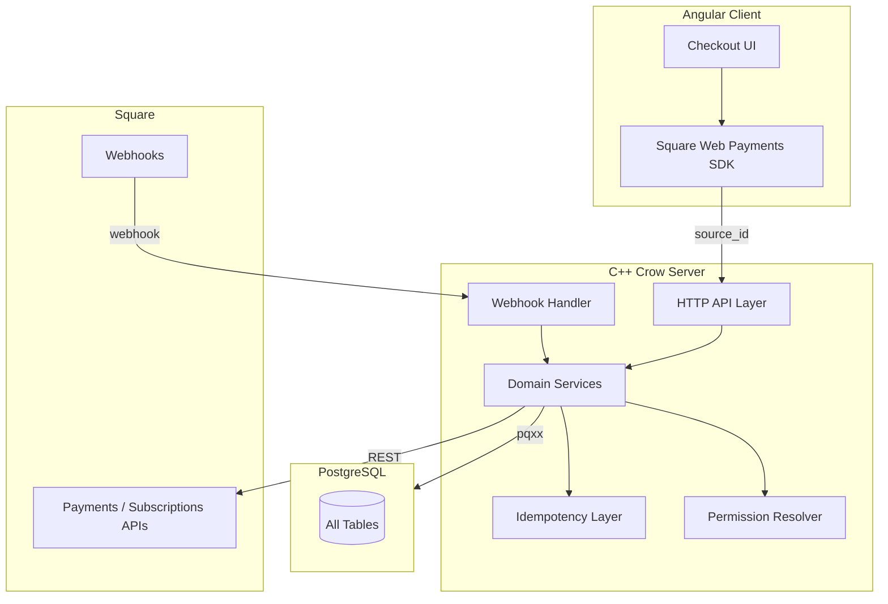
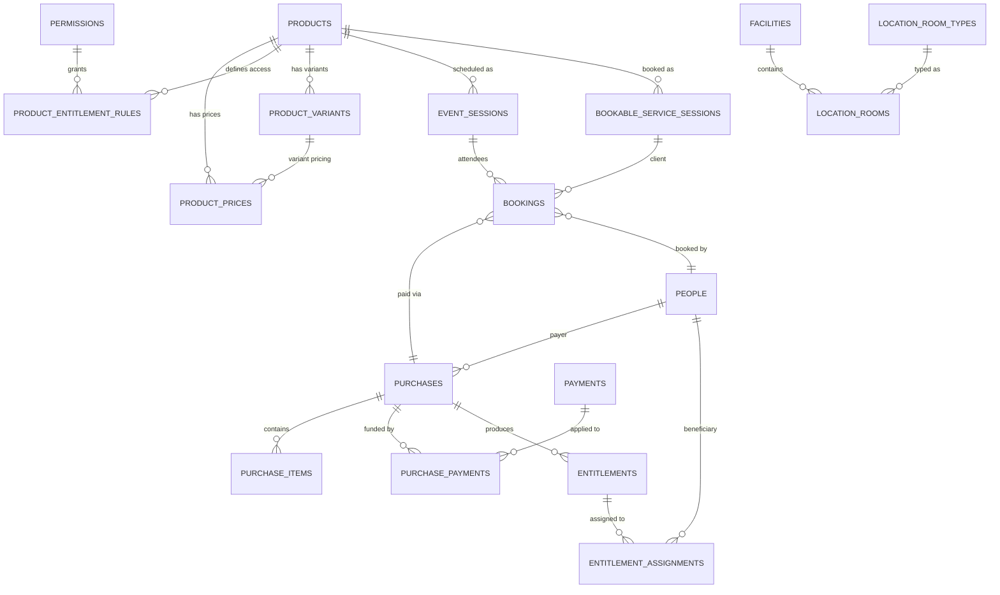
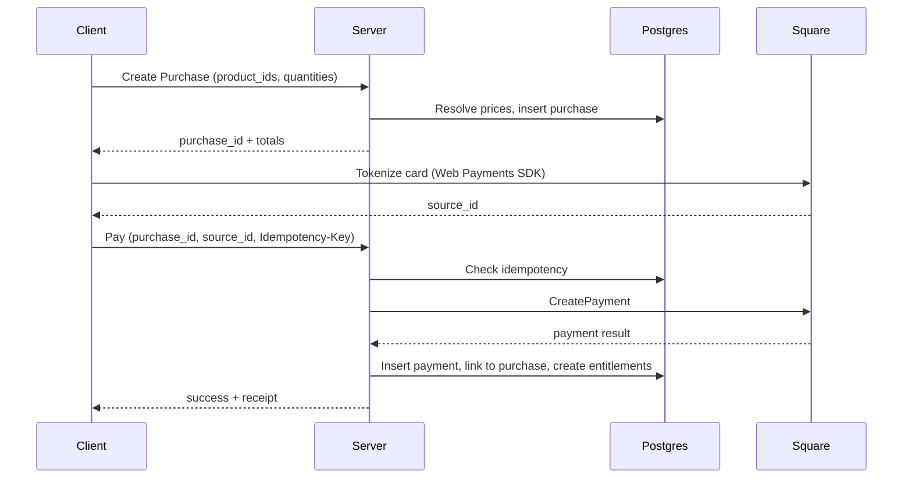

# 1. Overview

The Knotty Yoga payment system supports one-time payments, subscriptions, multi-person services, permission-based pricing, vouchers, scheduled event bookings, bookable service sessions, and scenarios where one person pays on behalf of others.

## Core Principles

These principles are referenced throughout the document and should be understood before proceeding:

1. **Separation of Concerns**: The system explicitly separates payments (money movement), purchases (intent), entitlements (access grants), and permissions (capabilities). A payment never directly grants access.

2. **Immutability**: Payments and entitlements are immutable records. Corrections and refunds are modeled as new records, not mutations. This ensures a complete audit trail.

3. **Computed Permissions**: Permissions are derived dynamically from roles and active entitlements—never stored directly as a result of payments. When an entitlement expires, permissions disappear automatically.

4. **Payer/Beneficiary Decoupling**: The person who pays is separate from the person(s) who receive access. This supports gifting, family memberships, and couples services.

5. **Idempotency First**: All operations that can be retried must be safely repeatable without side effects.

## Conceptual Flow

1. A **purchase** is created with server-resolved pricing
2. One or more **payments** fund the purchase
3. Funded purchases produce **entitlements**
4. Entitlements have **seat assignments** to specific people
5. **Effective permissions** = role permissions ∪ entitlement-derived permissions
6. For scheduled products, a **booking** links the purchase to a specific **event session** or **service session**

## Time and Identity

- All timestamps: `BIGINT` microseconds since epoch (UTC), column names use `*_us` suffix
- All IDs: 64-bit integers, serialized as strings in APIs for JavaScript safety

---

# 2. Goals and Non-Goals

## Goals

- **Real-world payment scenarios**: One-time purchases, subscriptions, multi-person purchases, gifting, mixed payment methods (card + voucher)
- **Correctness under failure**: No double-charging or double-fulfillment, even with retries, crashes, or network failures
- **Complete audit trail**: All money movement and access grants are traceable and explainable
- **Permission-based pricing**: Different prices for the same product based on membership tier, without duplicating products
- **Calendar-month subscriptions**: Subscriptions align to calendar months, not rolling 30-day windows
- **Incremental delivery**: System can be built in phases, with early phases delivering real value

## Non-Goals

- **Full accounting system**: No general ledger, tax reporting, or invoicing beyond basic receipts
- **Multi-provider abstraction**: Initial implementation is Square-only; no premature abstraction
- **Real-time pricing experiments**: No A/B pricing or dynamic surge pricing
- **Permission mutation**: Permissions are computed, never directly inserted/deleted based on payments

---

# 3. Assumptions

## Hard Assumptions

- **PostgreSQL is system of record**: All invariants enforced at DB layer where feasible
- **Square is sole payment provider** (initially)
- **All monetary amounts are integer cents** with explicit currency
- **Timestamps are microseconds since epoch (UTC)**
- **IDs are 64-bit integers**

## Configurable Assumptions

- **Permission-based pricing**: Prices vary by permission; NULL permission = fallback price for all
- **Calendar-month subscription semantics**: UTC month boundaries
- **Entitlements are immutable**: Changes happen via revocation + new entitlement, not mutation
- **Effective permissions are computed**: May add caching later if needed

---

# 4. Requirements

## Must-Have

- Securely accept payments via provider-issued tokens (never handle raw card data)
- Prevent double-charging and double-fulfillment through idempotency
- Persist all financial and access data durably
- Support one person paying for another's services
- Support multi-seat services with enforced seat limits

## Should-Have

- Subscriptions with recurring billing and webhook-driven renewals
- Cards on file for faster checkout and recurring billing
- Permission-based pricing without product duplication
- Grace periods for failed subscription payments
- Email notifications for payment events

## Could-Have

- Vouchers and credits for partial/full coverage
- Partial payments and split funding
- Refunds and adjustments via correcting transactions

---

# 5. High-Level Design

## Component Architecture



## Core Entity Relationships



## Pricing Resolution

For each product in a purchase:
1. Compute user's effective permissions (roles + active entitlements)
2. Find product prices for active schedule
3. Select most specific price matching user's permissions, or NULL-permission fallback
4. If no applicable price, product is not purchasable

## Primary Flow: One-Time Purchase



---

# 6. API Overview

## Conventions

- **Authentication**: Cookie-based sessions (existing middleware)
- **IDs**: Serialized as strings in JSON
- **Timestamps**: `int64` microseconds since epoch
- **Money**: Integer cents with explicit currency
- **Idempotency**: `Idempotency-Key` header for all mutating operations

## Error Response Format (RFC 7807)

All errors return structured JSON following [RFC 7807 (Problem Details for HTTP APIs)](https://datatracker.ietf.org/doc/html/rfc7807):

```json
{
  "type": "payment_declined",
  "title": "Payment Declined",
  "status": 402,
  "detail": "Your card was declined. Please try another card.",
  "provider": "square",
  "provider_code": "CARD_DECLINED"
}
```

| Field | Type | Required | Description |
|-------|------|----------|-------------|
| `type` | string | Yes | Error code identifier |
| `title` | string | Yes | Short human-readable summary |
| `status` | integer | Yes | HTTP status code |
| `detail` | string | Yes | Human-readable explanation |
| `field` | string | No | For validation errors, which field failed |
| `constraint` | string | No | What constraint was violated |
| `provider` | string | No | For payment errors, which provider |
| `provider_code` | string | No | Provider's error code |

**Error types**: `validation_error`, `bad_request`, `not_authenticated`, `invalid_credentials`, `session_expired`, `not_authorized`, `not_found`, `idempotency_conflict`, `internal_error`, `payment_declined`, `payment_failed`, `voucher_invalid`, `seats_exceeded`

> **Status**: Error responses have been implemented using `ErrorResponse` helper class. See `util/error_response.h` for factory methods.

## Endpoints

### Catalog & Pricing

| Method | Endpoint | Description |
|--------|----------|-------------|
| GET | `/api/catalog_products` | Product catalog visible to current user |
| POST | `/api/catalog_quote` | Resolve pricing for requested items (read-only) |

### Purchases

| Method | Endpoint | Description |
|--------|----------|-------------|
| POST | `/api/purchase_create` | Create purchase with server-resolved pricing |
| GET | `/api/purchase/{purchase_id}` | Get purchase details and funding state |
| POST | `/api/purchase_cancel/{purchase_id}` | Cancel unfunded purchase |

### Payments

| Method | Endpoint | Description |
|--------|----------|-------------|
| POST | `/api/purchase_pay_card/{purchase_id}` | Charge via tokenized card |
| POST | `/api/purchase_pay_voucher/{purchase_id}` | Apply voucher code |
| GET | `/api/payments` | Payment history for current user |

### Entitlements

| Method | Endpoint                                    | Description                          |
| ------ | ------------------------------------------- | ------------------------------------ |
| GET    | `/api/entitlements`                         | Active entitlements for current user |
| POST   | `/api/entitlement_assign/{entitlement_id}`  | Assign seat to person                |
| POST   | `/api/entitlement_unassign/{assignment_id}` | Remove seat assignment               |

### Scheduling & Bookings

| Method | Endpoint | Description |
|--------|----------|-------------|
| GET | `/api/visible_event_sessions?placement=` | Visible event sessions (home_page or upcoming) |
| GET | `/api/event_session/{session_id}` | Event session detail with pricing |
| POST | `/api/book_event/{session_id}` | Book user into an event session |
| GET | `/api/my_bookings` | User's bookings (optional `?status=` filter) |
| GET | `/api/admin/event_session/{session_id}/attendees` | Admin: attendees for a session |

### Subscriptions

| Method | Endpoint | Description |
|--------|----------|-------------|
| POST | `/api/subscription_start` | Start subscription signup flow |
| POST | `/api/webhook_square` | Square webhook receiver |

---

# 7. Data Model

All tables follow existing codebase patterns: schema defined via `DatabaseInfo::AddColumn*` methods in `db_schema/*.cpp`, with corresponding `TableHelpers::*` classes.

## Products and Pricing

### products
| Column | Type | Notes |
|--------|------|-------|
| id | BIGSERIAL | PK |
| code | VARCHAR(64) | Unique, e.g. "MASSAGE_60" |
| name | VARCHAR(128) | |
| description | VARCHAR(1024) | |
| kind | VARCHAR(32) | "one_time", "subscription", or "event" |
| default_capacity | BIGINT | Nullable, for event products |
| duration_minutes | BIGINT | Nullable, default event/service duration |
| visibility_permission_id | BIGINT | FK → permissions, nullable. NULL = visible to all |
| booking_permission_id | BIGINT | FK → permissions, nullable. NULL = anyone can book |
| cancellation_policy_id | BIGINT | FK → cancellation_policies, nullable |
| required_room_type_id | BIGINT | FK → location_room_types, nullable |
| advance_booking_days | BIGINT | Nullable, max days in advance to book |
| booking_cutoff_hours | BIGINT | Nullable, min hours before event to book |
| reminder_hours | BIGINT | Nullable, hours before event to send reminder |
| max_time_hole_minutes | BIGINT | Nullable, for bookable services |
| is_active | BOOLEAN | |
| created_us | BIGINT | |
| updated_us | BIGINT | |

### price_schedules
| Column        | Type         | Notes                     |
| ------------- | ------------ | ------------------------- |
| id            | BIGSERIAL    | PK                        |
| name          | VARCHAR(128) | e.g. "2026 Spring Prices" |
| valid_from_us | BIGINT       |                           |
| valid_to_us   | BIGINT       | Exclusive end             |
| is_active     | BOOLEAN      |                           |
| created_us    | BIGINT       |                           |
| updated_us    | BIGINT       |                           |

### product_prices
| Column            | Type       | Notes                             |
| ----------------- | ---------- | --------------------------------- |
| id                | BIGSERIAL  | PK                                |
| product_id        | BIGINT     | FK → products                     |
| price_schedule_id | BIGINT     | FK → price_schedules              |
| permission_id     | BIGINT     | FK → permissions, NULL = fallback |
| currency          | VARCHAR(3) | Default 'USD'                     |
| product_variant_id | BIGINT    | FK → product_variants, nullable   |
| amount_cents      | BIGINT     |                                   |
| created_us        | BIGINT     |                                   |
| updated_us        | BIGINT     |                                   |

**Unique constraint**: (product_id, price_schedule_id, permission_id, product_variant_id)

### product_entitlement_rules
Defines what access a product grants when purchased.

| Column | Type | Notes |
|--------|------|-------|
| id | BIGSERIAL | PK |
| product_id | BIGINT | FK → products, unique |
| grants_permission_id | BIGINT | FK → permissions, nullable |
| seats_default | BIGINT | Default 1 |
| validity_kind | VARCHAR(32) | "instant", "calendar_month", "days_from_activation" |
| validity_days | BIGINT | For "days_from_activation", nullable |
| created_us | BIGINT | |
| updated_us | BIGINT | |

## Purchases and Payments

### purchases
| Column | Type | Notes |
|--------|------|-------|
| id | BIGSERIAL | PK |
| payer_person_id | BIGINT | FK → people |
| status | VARCHAR(32) | "pending_payment", "funded", "canceled" |
| currency | VARCHAR(3) | |
| subtotal_cents | BIGINT | |
| tax_cents | BIGINT | Default 0 |
| total_cents | BIGINT | |
| paid_cents | BIGINT | Maintained by server |
| portal_note | VARCHAR(512) | User-visible description |
| created_us | BIGINT | |
| updated_us | BIGINT | |

### purchase_items
| Column | Type | Notes |
|--------|------|-------|
| id | BIGSERIAL | PK |
| purchase_id | BIGINT | FK → purchases |
| product_id | BIGINT | FK → products |
| quantity | BIGINT | |
| currency | VARCHAR(3) | |
| unit_price_cents | BIGINT | Snapshot at purchase time |
| line_total_cents | BIGINT | |
| price_schedule_id | BIGINT | FK → price_schedules |
| pricing_permission_id | BIGINT | Which permission matched, nullable |
| product_variant_id | BIGINT | FK → product_variants, nullable |
| created_us | BIGINT | |

### payments
| Column | Type | Notes |
|--------|------|-------|
| id | BIGSERIAL | PK |
| provider | VARCHAR(32) | "square", "voucher", "cash" |
| provider_payment_id | VARCHAR(128) | Square payment ID, etc. |
| status | VARCHAR(32) | "authorized", "captured", "failed", "refunded" |
| currency | VARCHAR(3) | |
| amount_cents | BIGINT | Money moved (negative for refunds) |
| covered_amount_cents | BIGINT | For vouchers |
| payer_person_id | BIGINT | FK → people |
| portal_note | VARCHAR(512) | |
| refund_for_payment_id | BIGINT | FK → payments, nullable |
| refund_reason | VARCHAR(256) | Nullable |
| raw_provider_json | VARCHAR(8192) | |
| created_us | BIGINT | |
| updated_us | BIGINT | |

**Unique constraint**: (provider, provider_payment_id)

### purchase_payments
| Column | Type | Notes |
|--------|------|-------|
| id | BIGSERIAL | PK |
| purchase_id | BIGINT | FK → purchases |
| payment_id | BIGINT | FK → payments |
| applied_cents | BIGINT | |
| created_us | BIGINT | |

**Unique constraint**: (purchase_id, payment_id)

## Entitlements

### entitlements
| Column | Type | Notes |
|--------|------|-------|
| id | BIGSERIAL | PK |
| purchase_id | BIGINT | FK → purchases |
| purchase_item_id | BIGINT | FK → purchase_items, nullable |
| product_id | BIGINT | FK → products |
| valid_from_us | BIGINT | |
| valid_to_us | BIGINT | Exclusive |
| seats_total | BIGINT | |
| status | VARCHAR(32) | "active", "expired" |
| revoked_us | BIGINT | Nullable, for cancellations |
| revoked_reason | VARCHAR(256) | Nullable |
| notes | VARCHAR(1024) | |
| created_us | BIGINT | |
| updated_us | BIGINT | |

### entitlement_assignments
| Column | Type | Notes |
|--------|------|-------|
| id | BIGSERIAL | PK |
| entitlement_id | BIGINT | FK → entitlements |
| person_id | BIGINT | FK → people |
| removed_us | BIGINT | Nullable, for reassignment |
| removed_reason | VARCHAR(256) | Nullable |
| created_us | BIGINT | |

**Unique constraint**: (entitlement_id, person_id) where removed_us IS NULL

**Trigger**: `enforce_entitlement_seats` prevents assignments exceeding `seats_total`.

## Vouchers

### vouchers
| Column                | Type        | Notes    |
| --------------------- | ----------- | -------- |
| id                    | BIGSERIAL   | PK       |
| code                  | VARCHAR(64) | Unique   |
| currency              | VARCHAR(3)  |          |
| initial_value_cents   | BIGINT      |          |
| remaining_value_cents | BIGINT      |          |
| is_active             | BOOLEAN     |          |
| expires_us            | BIGINT      | Nullable |
| created_us            | BIGINT      |          |
| updated_us            | BIGINT      |          |

### voucher_redemptions
| Column | Type | Notes |
|--------|------|-------|
| id | BIGSERIAL | PK |
| voucher_id | BIGINT | FK → vouchers |
| purchase_id | BIGINT | FK → purchases |
| payment_id | BIGINT | FK → payments |
| redeemed_cents | BIGINT | |
| created_us | BIGINT | |

## Square Integration

### square_customers
| Column | Type | Notes |
|--------|------|-------|
| id | BIGSERIAL | PK |
| person_id | BIGINT | FK → people, unique |
| square_customer_id | VARCHAR(64) | Unique |
| created_us | BIGINT | |
| updated_us | BIGINT | |

### square_cards
| Column | Type | Notes |
|--------|------|-------|
| id | BIGSERIAL | PK |
| person_id | BIGINT | FK → people |
| square_customer_id | VARCHAR(64) | |
| square_card_id | VARCHAR(64) | Unique |
| brand | VARCHAR(32) | |
| last4 | VARCHAR(8) | |
| exp_month | BIGINT | |
| exp_year | BIGINT | |
| is_active | BOOLEAN | |
| created_us | BIGINT | |
| updated_us | BIGINT | |

### square_subscriptions
| Column | Type | Notes |
|--------|------|-------|
| id | BIGSERIAL | PK |
| person_id | BIGINT | FK → people |
| product_id | BIGINT | FK → products |
| square_subscription_id | VARCHAR(64) | Unique |
| square_customer_id | VARCHAR(64) | |
| status | VARCHAR(32) | "active", "canceled", "paused", "delinquent" |
| current_period_start_us | BIGINT | |
| current_period_end_us | BIGINT | |
| grace_period_ends_us | BIGINT | Nullable, set when payment fails |
| canceled_us | BIGINT | Nullable |
| created_us | BIGINT | |
| updated_us | BIGINT | |

### square_webhook_events
| Column | Type | Notes |
|--------|------|-------|
| id | BIGSERIAL | PK |
| event_id | VARCHAR(128) | Unique |
| event_type | VARCHAR(128) | |
| received_us | BIGINT | |
| processed_us | BIGINT | |
| raw_json | VARCHAR(8192) | |

## Idempotency

### idempotency_keys
| Column | Type | Notes |
|--------|------|-------|
| id | BIGSERIAL | PK |
| scope | VARCHAR(64) | e.g. "user:123" or "webhook:square" |
| key | VARCHAR(128) | Client-provided key |
| endpoint | VARCHAR(128) | |
| request_hash | VARCHAR(128) | |
| status | VARCHAR(32) | "pending", "completed", "failed" |
| response_json | VARCHAR(8192) | |
| created_us | BIGINT | |
| expires_us | BIGINT | TTL, typically 48 hours |

**Unique constraint**: (scope, key, endpoint)

**TTL Policy**: Records expire after 48 hours. After expiry, the same key can be reused.

**Partial Failure Handling**:
1. Insert idempotency record with status="pending" before external call
2. On success, update to status="completed" with response
3. On retry with "pending" found, re-query provider by idempotency key
4. On retry with "completed" found, return stored response

## Scheduling and Booking

The following tables were added to support event scheduling, bookable services, and the booking flow. They integrate with the purchase/payment tables above — a booking is always linked to a purchase.

### facilities
| Column | Type | Notes |
|--------|------|-------|
| id | BIGSERIAL | PK |
| code | VARCHAR | Unique |
| name | VARCHAR | |
| address_line_1 | VARCHAR | |
| address_line_2 | VARCHAR | Nullable |
| city | VARCHAR | |
| state | VARCHAR | |
| postal_code | VARCHAR | |
| country | VARCHAR | Default 'USA' |
| timezone | VARCHAR | Default 'America/Los_Angeles' |
| is_active | BOOLEAN | Default true |
| created_us | BIGINT | |
| updated_us | BIGINT | |

### location_room_types
| Column | Type | Notes |
|--------|------|-------|
| id | BIGSERIAL | PK |
| code | VARCHAR | Unique |
| name | VARCHAR | |
| description | VARCHAR | Nullable |
| created_us | BIGINT | |
| updated_us | BIGINT | |

### location_rooms
| Column | Type | Notes |
|--------|------|-------|
| id | BIGSERIAL | PK |
| facility_id | BIGINT | FK → facilities |
| room_type_id | BIGINT | FK → location_room_types |
| name | VARCHAR | |
| description | VARCHAR | Nullable |
| concurrent_capacity | BIGINT | Default 1 |
| is_active | BOOLEAN | Default true |
| created_us | BIGINT | |
| updated_us | BIGINT | |

### product_variants
Duration/pricing variants for bookable services (e.g., 30min, 60min, 90min massage).

| Column | Type | Notes |
|--------|------|-------|
| id | BIGSERIAL | PK |
| product_id | BIGINT | FK → products |
| code | VARCHAR | Unique |
| name | VARCHAR | |
| duration_minutes | BIGINT | |
| buffer_minutes | BIGINT | Default 0 |
| sort_order | BIGINT | Default 0 |
| is_active | BOOLEAN | Default true |
| created_us | BIGINT | |
| updated_us | BIGINT | |

### cancellation_policies
| Column | Type | Notes |
|--------|------|-------|
| id | BIGSERIAL | PK |
| name | VARCHAR | |
| description | VARCHAR | Nullable |
| created_us | BIGINT | |
| updated_us | BIGINT | |

### event_sessions
A specific scheduled instance of an event product (e.g., "Intro to Acrobatics on March 15 at 2pm").

| Column | Type | Notes |
|--------|------|-------|
| id | BIGSERIAL | PK |
| product_id | BIGINT | FK → products |
| facility_id | BIGINT | FK → facilities, nullable |
| location_room_id | BIGINT | FK → location_rooms, nullable |
| start_time_us | BIGINT | |
| end_time_us | BIGINT | |
| capacity | BIGINT | |
| booked_count | BIGINT | Default 0 |
| status | VARCHAR | Default 'scheduled' |
| show_on_home_page | BOOLEAN | Default false |
| home_page_visible_days_before | BIGINT | Nullable |
| show_on_upcoming | BOOLEAN | Default false |
| upcoming_visible_days_before | BIGINT | Nullable |
| cancellation_reason | VARCHAR | Nullable |
| notes | VARCHAR | Nullable |
| created_us | BIGINT | |
| updated_us | BIGINT | |

### bookable_service_sessions
A specific booked 1-on-1 service session with a provider (e.g., "60min massage with Jane at 10am").

| Column | Type | Notes |
|--------|------|-------|
| id | BIGSERIAL | PK |
| product_id | BIGINT | FK → products |
| product_variant_id | BIGINT | FK → product_variants |
| provider_person_id | BIGINT | FK → people |
| facility_id | BIGINT | FK → facilities |
| location_room_id | BIGINT | FK → location_rooms, nullable |
| start_time_us | BIGINT | |
| end_time_us | BIGINT | |
| buffer_end_us | BIGINT | Provider buffer time end |
| status | VARCHAR | Default 'scheduled' |
| cancellation_reason | VARCHAR | Nullable |
| notes | VARCHAR | Nullable |
| created_us | BIGINT | |
| updated_us | BIGINT | |

### bookings
Links a person's purchase to a specific event session or service session.

| Column | Type | Notes |
|--------|------|-------|
| id | BIGSERIAL | PK |
| event_session_id | BIGINT | FK → event_sessions, nullable |
| service_session_id | BIGINT | FK → bookable_service_sessions, nullable |
| purchase_id | BIGINT | FK → purchases |
| purchase_item_id | BIGINT | FK → purchase_items |
| person_id | BIGINT | FK → people |
| provider_person_id | BIGINT | FK → people, nullable |
| status | VARCHAR | Default 'confirmed' |
| waitlist_position | BIGINT | Nullable |
| cancelled_us | BIGINT | Nullable |
| checked_in_us | BIGINT | Nullable |
| notes | VARCHAR | Nullable |
| created_us | BIGINT | |
| updated_us | BIGINT | |

Exactly one of `event_session_id` or `service_session_id` should be non-NULL.

---

# 8. User Scenarios

This section documents the user scenarios the payment system must support, validates that the data model supports each scenario, and provides detailed flows for implementation reference.

## 8.1 Prioritized Scenarios

### Must Have (Phase 1: Thin Slice)
*Core payment flow - minimum viable product*
[[Purchase creation with server-side pricing]]

- [x] 1. User purchases a one time item for themself like an intro workshop or massage
- [x] 2. User tries to pay for a service and their card is declined and they need to retry with a different card
- [x] 3. Users should be able to view purchase history
- [x] 4. Users should be able to view payment history

### Should Have (Phases 2-3: Multi-Seat & Permission Pricing)
*Multi-person purchases and member pricing*
[[Payment Should Have- Multi Seat and Bundled Pricing]]

- [x] 5. User purchases a one time item for someone else like a massage or intro workshop
- [ ] 6. User purchases a one time item for themself and one or more other people like a couple's massage
- [ ] 7. User purchases a bundled product (e.g., massage + spa entry as a single product)
- [x] 8. User who has purchased a monthly membership receives a discount for other services (permission-based pricing)
- [x] 9. User reassigns seat to a different person (e.g., user buys party package and different guests show up)

### Nice to Have (Phase 4: Subscriptions)
*Recurring billing and card management*
[[Subscriptions- Recurring billing and card management]]

- [x] 10. User subscribes for a monthly service like Knotty Yoga Platinum
- [x] 11. User pays for a monthly subscription service for another user to receive
- [x] 12. User subscribes for a multi-seat monthly service (e.g., Couples Membership)
- [x] 13. User elects to cancel their subscription at the end of the month
- [x] 14. User has not paid for renewal - grace period before losing benefits
- [x] 15. User on subscription with card declined - grace period, notified to update payment
- [x] 16. New user buys membership for next month and gets remainder of current month free
- [x] 17. User saves a card on file for future payment
- [x] 18. User updates/removes a card on file
- [x] 19. User changes default payment method
- [x] 20. User receives expiring entitlement reminder
- [x] 21. User receives expiring card notification

### Handle in Future (Phases 5-6: Vouchers & Refunds)
*Gift cards, coupons, and refunds*
[[Vouchers and Refunds]]

- [x] 22. User redeems a voucher/gift card and fully consumes its value (Vouchers Phase 1-2: VoucherHelper, purchase_pay_voucher endpoint, checkout/event/service voucher UI)
- [x] 23. User redeems a voucher/gift card and has remaining balance (Vouchers Phase 2: split payment, partially_funded status, card payment on remaining balance)
- [x] 24. User uses a percentage-based discount coupon (Vouchers Phase 5: CouponHelper, coupons/coupon_products tables, check_coupon endpoint, coupon UI in all booking flows)
- [x] 25. User pays with multiple payment sources (card + voucher) (Vouchers Phase 2: purchase_payments junction, voucher then card split payment)
- [x] 26. Studio refunds a one time purchase item (RefundHelper + Square RefundPayment API; booking cancellation and session cancellation refunds)
- [x] 27. User cancels a monthly service and receives a prorated refund (Vouchers Phase 4: CalculateProratedRefund, AdminCancelWithRefund, subscription detail UI)
- [x] 28. Studio comps a service or good (Vouchers Phase 3: CompHelper creates store credit voucher, comp notification email, admin comp endpoint + UI)
- [x] 29. Admin grants entitlement without payment (comp) (Vouchers Phase 3: comp flow creates voucher-funded purchase + entitlement)
- [x] 30. Admin credits user account for future purchase (as voucher) (Vouchers Phase 1: CreateStoreCredit, admin create_voucher endpoint; Phase 2.5: refund-as-credit option)

### Low Priority (Post-MVP)
*Complex edge cases and admin features*

- [x] 31. User upgrades to a higher tier membership (prorated)
- [x] 32. User downgrades to a lower tier membership (effective next cycle)
- [x] 33. User reactivates after cancelling membership (history preserved)
- [ ] 34. User is gifted something but passes it on to someone else
- [ ] 35. Admin grants extension of a membership as reward
- [ ] 36. Credit card chargeback - invalidate payment, outstanding balance
- [ ] 37. Guest passes - member gifts discounted/free guest pass to another person
- [ ] 38. Product discontinued - existing entitlements remain valid, no new purchases
- [ ] 39. Entitlement expires while user is mid-session

## 8.2 Table Support by Scenario

### Must Have (Phase 1)

#### 1. User purchases a one time item for themself
**Supported** ✓

| Table | Fields Used |
|-------|-------------|
| `products` | id, code, name, kind="one_time", is_active |
| `price_schedules` | id, valid_from_us, valid_to_us, is_active |
| `product_prices` | product_id, price_schedule_id, permission_id=NULL, amount_cents |
| `purchases` | id, payer_person_id, status, total_cents, paid_cents |
| `purchase_items` | purchase_id, product_id, quantity, unit_price_cents, line_total_cents |
| `payments` | id, provider="square", status, amount_cents, payer_person_id |
| `purchase_payments` | purchase_id, payment_id, applied_cents |
| `product_entitlement_rules` | product_id, seats_default=1, validity_kind |
| `entitlements` | purchase_id, product_id, valid_from_us, valid_to_us, seats_total=1, status |
| `entitlement_assignments` | entitlement_id, person_id (same as payer) |

#### 2. Card declined, retry with different card
**Supported** ✓

| Table | Fields Used |
|-------|-------------|
| `payments` | status="failed" for declined attempt |
| `idempotency_keys` | New key for retry attempt |

Server returns error response; client retries with new card token and new idempotency key.

#### 3. View purchase history
**Supported** ✓

| Table | Fields Used |
|-------|-------------|
| `purchases` | Query by payer_person_id |
| `purchase_items` | Join on purchase_id for line items |
| `products` | Join for product names |

#### 4. View payment history
**Supported** ✓

| Table | Fields Used |
|-------|-------------|
| `payments` | Query by payer_person_id |
| `purchase_payments` | Join to show which purchases each payment funded |

---

### Should Have (Phases 2-3)

#### 5. User purchases for someone else
**Supported** ✓

| Table | Fields Used |
|-------|-------------|
| `purchases` | payer_person_id = buyer |
| `entitlement_assignments` | person_id = recipient (different from payer) |

Same as scenario 1, but assignment goes to different person.

#### 6. Multi-seat purchase (couple's massage)
**Supported** ✓

| Table | Fields Used |
|-------|-------------|
| `product_entitlement_rules` | seats_default > 1 |
| `entitlements` | seats_total = seats_default from rule |
| `entitlement_assignments` | Multiple rows, one per person |

Trigger `enforce_entitlement_seats` prevents exceeding seats_total.

#### 7. Bundled product (massage + spa combo)
**Supported** ✓

| Table | Fields Used |
|-------|-------------|
| `products` | Single product representing the bundle |
| `product_entitlement_rules` | One rule for the bundle |

**Note**: Bundle is a single product. If bundle needs to grant multiple distinct entitlements, would need `product_entitlement_rules` to allow multiple rules per product (currently unique on product_id).

#### 8. Permission-based pricing (member discount)
**Supported** ✓

| Table | Fields Used |
|-------|-------------|
| `product_prices` | permission_id links to member permission |
| `product_entitlement_rules` | grants_permission_id on membership product |
| `entitlements` | Active membership entitlement |
| `entitlement_assignments` | User assigned to membership |

Effective permission computation finds member permission → matches product_prices row with lower amount_cents.

#### 9. Reassign seat to different person
**Supported** ✓

| Table | Fields Used |
|-------|-------------|
| `entitlement_assignments` | Set removed_us, removed_reason on old assignment |
| `entitlement_assignments` | Create new row for new person |

---

### Nice to Have (Phase 4)

#### 10. Subscribe to monthly service
**Supported** ✓

| Table | Fields Used |
|-------|-------------|
| `products` | kind="subscription" |
| `square_subscriptions` | person_id, product_id, square_subscription_id, status, current_period_start_us, current_period_end_us |
| `square_customers` | Links person to Square customer ID |
| `entitlements` | Created per billing period via webhook |

#### 11. Subscribe for another user
**Supported** ✓

| Table | Fields Used |
|-------|-------------|
| `square_subscriptions` | person_id = payer (subscription owner) |
| `entitlement_assignments` | person_id = beneficiary |

#### 12. Multi-seat subscription (Couples Membership)
**Supported** ✓

| Table | Fields Used |
|-------|-------------|
| `product_entitlement_rules` | seats_default > 1 |
| `entitlements` | seats_total from rule |
| `entitlement_assignments` | Multiple rows per entitlement |

#### 13. Cancel subscription at end of month
**Supported** ✓

| Table | Fields Used |
|-------|-------------|
| `square_subscriptions` | canceled_us set, status remains "active" until period ends |

Square handles not charging next period.

#### 14. Grace period before losing benefits
**Supported** ✓

| Table | Fields Used |
|-------|-------------|
| `square_subscriptions` | grace_period_ends_us, status="delinquent" |
| `entitlements` | Still valid while grace_period_ends_us > now |

#### 15. Subscription card declined, grace period
**Supported** ✓

| Table | Fields Used |
|-------|-------------|
| `square_webhook_events` | Captures payment failure event |
| `square_subscriptions` | status="delinquent", grace_period_ends_us set |

Same as 14, triggered by webhook.

#### 16. Buy next month, get current month free
**Supported** ✓

| Table | Fields Used |
|-------|-------------|
| `entitlements` | valid_from_us = start of current month (not next month) |

Business logic decision at entitlement creation time.

#### 17. Save card on file
**Supported** ✓

| Table | Fields Used |
|-------|-------------|
| `square_customers` | person_id, square_customer_id |
| `square_cards` | person_id, square_card_id, brand, last4, exp_month, exp_year, is_active |

#### 18. Update/remove card on file
**Supported** ✓

| Table | Fields Used |
|-------|-------------|
| `square_cards` | is_active=false to remove; update exp fields for update |

#### 19. Change default payment method
**Partially Supported** ⚠️

| Table | Fields Used |
|-------|-------------|
| `square_cards` | Need to add `is_default` column |

**Gap**: No `is_default` column on `square_cards`. Add: `is_default BOOLEAN DEFAULT FALSE`.

#### 20. Expiring entitlement reminder
**Supported** ✓

| Table | Fields Used |
|-------|-------------|
| `entitlements` | valid_to_us queried by scheduled job |
| `entitlement_assignments` | person_id for email recipient |

#### 21. Expiring card notification
**Supported** ✓

| Table | Fields Used |
|-------|-------------|
| `square_cards` | exp_month, exp_year queried by scheduled job |

---

### Handle in Future (Phases 5-6)

#### 22. Voucher fully consumed
**Supported** ✓

| Table | Fields Used |
|-------|-------------|
| `vouchers` | remaining_value_cents becomes 0 |
| `voucher_redemptions` | voucher_id, purchase_id, payment_id, redeemed_cents |
| `payments` | provider="voucher" |

#### 23. Voucher partial redemption
**Supported** ✓

| Table | Fields Used |
|-------|-------------|
| `vouchers` | remaining_value_cents > 0 after redemption |
| `voucher_redemptions` | redeemed_cents < initial_value_cents |

#### 24. Percentage-based discount coupon
**Supported** ✓

| Table | Fields Used |
|-------|-------------|
| `coupons` | code, discount_type, discount_value, max_uses, current_uses, valid_from/to_us, is_active |
| `coupon_products` | coupon_id, product_id (many-to-many product restriction) |
| `coupon_redemptions` | coupon_id, purchase_id, discount_cents |
| `purchases` | discount_cents tracks coupon discount |

#### 25. Multiple payment sources
**Supported** ✓

| Table | Fields Used |
|-------|-------------|
| `payments` | Multiple payment records |
| `purchase_payments` | Multiple rows linking payments to purchase |
| `purchases` | paid_cents accumulates until = total_cents |

#### 26. Refund one-time purchase
**Supported** ✓

| Table | Fields Used |
|-------|-------------|
| `payments` | New row with negative amount_cents, refund_for_payment_id, refund_reason |
| `entitlements` | revoked_us, revoked_reason set |

#### 27. Prorated subscription refund
**Supported** ✓ — **Implemented**

| Table | Fields Used |
|-------|-------------|
| `payments` | Negative amount_cents (prorated calculation) |
| `subscriptions` | status='cancelled', cancellation_effective_us=now |
| `entitlements` | Revoked by AdminCancelWithRefund |

CalculateProratedRefund computes unused portion. AdminCancelWithRefund processes refund to card or as store credit.

#### 28. Comp service or good
**Supported** ✓ — **Implemented**

| Table | Fields Used |
|-------|-------------|
| `vouchers` | Store credit voucher created for product price |
| `purchases` | Created when person uses the comp voucher |
| `payments` | provider="voucher" when redeemed |

CompHelper looks up product price, creates person-tied store credit voucher, sends notification email.

#### 29. Admin grants entitlement without payment
**Supported** ✓ — **Implemented**

| Table | Fields Used |
|-------|-------------|
| `vouchers` | Comp creates store credit for product price |
| `purchases` | Person uses voucher → creates purchase at $0 net cost |
| `entitlements` | Created through normal purchase fulfillment pipeline |

Uses option 2 (system purchase for audit trail) via the comp → voucher → purchase flow.

#### 30. Admin credits account (as voucher)
**Supported** ✓

| Table | Fields Used |
|-------|-------------|
| `vouchers` | Admin creates voucher with initial_value_cents |

Admin UI would create voucher and optionally email code to user.

---

### Low Priority (Post-MVP)

#### 31. Upgrade to higher tier (prorated)
**Partially Supported** ⚠️

| Table | Fields Used |
|-------|-------------|
| `square_subscriptions` | Update product_id, recalculate period |
| `entitlements` | Revoke old, create new with upgraded product |

**Gap**: Proration logic not defined. Square may handle via subscription update API.

#### 32. Downgrade to lower tier
**Partially Supported** ⚠️

| Table | Fields Used |
|-------|-------------|
| `square_subscriptions` | Update product_id effective next period |
| `entitlements` | Current entitlement unchanged; next period gets lower tier |

Similar to upgrade but deferred to next billing cycle.

#### 33. Reactivate after cancelling
**Supported** ✓

| Table | Fields Used |
|-------|-------------|
| `square_subscriptions` | Create new subscription record or update status |
| `entitlements` | New entitlement created |

History preserved - old subscription/entitlement records remain.

#### 34. Pass gift on to someone else
**Supported** ✓

| Table | Fields Used |
|-------|-------------|
| `entitlement_assignments` | removed_us on original recipient |
| `entitlement_assignments` | New row for new recipient |

Same as scenario 9 (reassign seat).

#### 35. Admin extends membership
**Supported** ✓

| Table | Fields Used |
|-------|-------------|
| `entitlements` | Update valid_to_us to later date |

Or create new entitlement for extension period with notes explaining reason.

#### 36. Credit card chargeback
**Partially Supported** ⚠️

| Table | Fields Used |
|-------|-------------|
| `payments` | status="chargedback" (new status value) |
| `entitlements` | revoked_us, revoked_reason |
| `purchases` | paid_cents reduced |

**Gap**: Need to add "chargedback" to payments.status enum. May need outstanding balance tracking if partial chargeback.

#### 37. Guest passes
**Not Supported** ✗

**Gap**: No guest pass infrastructure. Would need:
```
guest_passes (id, granting_entitlement_id, owner_person_id,
              recipient_person_id, recipient_email,
              valid_from_us, valid_to_us, redeemed_us,
              created_us)
```
Plus logic to auto-grant passes when membership entitlement created.

#### 38. Product discontinued
**Supported** ✓

| Table | Fields Used |
|-------|-------------|
| `products` | is_active = false |
| `entitlements` | Existing entitlements remain valid until valid_to_us |

Set `products.is_active = false`. Catalog queries filter by is_active, so product no longer appears for purchase. Existing entitlements are unaffected.

#### 39. Entitlement expires while user is mid-session
**Supported** ✓ (Policy decision, not technical)

| Table | Fields Used |
|-------|-------------|
| `entitlements` | valid_to_us records exact expiration |
| Check-in system | Records check-in time |

The system records the expiration timestamp. Whether a user can finish their session after expiration is a policy decision enforced by the check-in/front desk system, not the payment system. Recommended policy: if user checked in while entitlement was valid, they can finish their session.

## 8.3 Detailed Flows

### Must Have (Phase 1)

#### Scenario 1: User purchases a one-time item for themself

**Actor**: Customer (logged in)
**Example**: User buys a 60-minute massage for $160

**Flow**:
1. User browses catalog → `GET /api/catalog_products`
   - Server queries `products` where `is_active = true`
   - Server resolves prices from `product_prices` using active `price_schedules` and user's effective permissions
   - Returns product list with resolved prices

2. User selects product and quantity → `POST /api/purchase_create`
   - Server creates `purchases` row (status="pending_payment", payer_person_id=user)
   - Server creates `purchase_items` row with snapshotted price
   - Returns purchase_id and totals

3. User enters card in Square Web Payments SDK
   - Client-side tokenization, returns source_id
   - No server involvement, card data never touches our server

4. User submits payment → `POST /api/purchase_pay_card/{purchase_id}`
   - Server checks `idempotency_keys` for duplicate
   - Server calls Square CreatePayment API
   - On success: creates `payments` row (provider="square", status="captured")
   - Creates `purchase_payments` linking payment to purchase
   - Updates `purchases.paid_cents`; if paid_cents >= total_cents, status="funded"
   - Creates `entitlements` row based on `product_entitlement_rules`
   - Creates `entitlement_assignments` row (person_id = payer_person_id)
   - Returns success + receipt

**Result**: User has entitlement for 60-minute massage they can redeem.

---

#### Scenario 2: Card declined, retry with different card

**Actor**: Customer (logged in)
**Example**: User's first card is declined, they try another

**Flow**:
1. Steps 1-3 from Scenario 1 complete normally

2. User submits payment → `POST /api/purchase_pay_card/{purchase_id}`
   - Server calls Square CreatePayment API
   - Square returns CARD_DECLINED error
   - Server creates `payments` row with status="failed"
   - Returns error response: `{ "type": "payment_declined", "detail": "Your card was declined..." }`

3. Client shows error, prompts for different card
   - User enters new card in Square SDK, gets new source_id

4. User retries → `POST /api/purchase_pay_card/{purchase_id}` with NEW Idempotency-Key
   - Server processes as new payment attempt
   - Square accepts, creates successful payment
   - Flow continues as Scenario 1 step 4

**Key Point**: New idempotency key required for retry. Purchase remains in "pending_payment" until successful payment.

---

#### Scenario 3: View purchase history

**Actor**: Customer (logged in)

**Flow**:
1. User navigates to purchase history → `GET /api/purchases`
   - Server queries `purchases` where `payer_person_id = current_user`
   - Joins `purchase_items` for line item details
   - Joins `products` for product names
   - Orders by created_us DESC
   - Returns list with pagination

**Response includes**: purchase_id, date, status, items purchased, totals, payment status

---

#### Scenario 4: View payment history

**Actor**: Customer (logged in)

**Flow**:
1. User navigates to payment history → `GET /api/payments`
   - Server queries `payments` where `payer_person_id = current_user`
   - Joins `purchase_payments` and `purchases` to show what each payment funded
   - Orders by created_us DESC
   - Returns list with pagination

**Response includes**: payment_id, date, amount, provider, status, linked purchase(s)

---

### Should Have (Phases 2-3)

#### Scenario 5: User purchases for someone else

**Actor**: Customer (logged in)
**Example**: User buys a massage gift for their friend

**Flow**:
1. Same as Scenario 1 steps 1-3

2. User submits payment with beneficiary specified → `POST /api/purchase_pay_card/{purchase_id}`
   - Request includes `beneficiary_person_id` or `beneficiary_email`
   - If email provided and person doesn't exist, create pending invitation

3. On successful payment:
   - Creates `entitlements` row (purchase.payer_person_id = buyer)
   - Creates `entitlement_assignments` row with `person_id = beneficiary` (not payer)

**Result**: Buyer paid, but friend has the entitlement to redeem the massage.

---

#### Scenario 6: Multi-seat purchase (couple's massage)

**Actor**: Customer (logged in)
**Example**: User buys couples massage for themselves and partner

**Flow**:
1. Product "Couples Massage" has `product_entitlement_rules.seats_default = 2`

2. User purchases product (Scenario 1 flow)

3. On successful payment:
   - Creates `entitlements` row with `seats_total = 2`
   - Creates first `entitlement_assignments` for buyer
   - User is prompted to assign second seat

4. User assigns second seat → `POST /api/entitlement_assign/{entitlement_id}`
   - Request includes `person_id` or `email` for partner
   - Server checks: count of active assignments < seats_total
   - Creates second `entitlement_assignments` row
   - Trigger `enforce_entitlement_seats` prevents over-assignment

**Result**: Both buyer and partner have assignments; both can redeem.

---

#### Scenario 7: Bundled product purchase

**Actor**: Customer (logged in)
**Example**: User buys "Massage + Spa Day Combo" for $200 (normally $160 + $60 = $220)

**Flow**:
1. Bundle exists as single `products` row: "Massage + Spa Day Combo"
2. Single `product_prices` row with amount_cents = 20000
3. Single `product_entitlement_rules` row defining what access it grants

4. Purchase flow identical to Scenario 1

**Note**: If bundle needs to grant multiple distinct entitlements (massage AND spa access), would need to either:
- Create single entitlement that grants access to both (simpler)
- Modify schema to allow multiple entitlement rules per product (more complex)

---

#### Scenario 8: Permission-based pricing (member discount)

**Actor**: Customer with active Platinum membership
**Example**: Platinum member buys massage at $140 instead of $160

**Flow**:
1. User has active Platinum membership
   - `entitlements` row exists: product_id = Platinum, status = "active", valid dates include now
   - `entitlement_assignments` links user to this entitlement
   - `product_entitlement_rules` for Platinum has `grants_permission_id` = "platinum_member"

2. User browses catalog → `GET /api/catalog_products`
   - Server computes effective permissions (role permissions ∪ entitlement-derived permissions)
   - Finds user has "platinum_member" permission
   - For massage product, finds `product_prices` rows:
     - permission_id = NULL, amount_cents = 16000 (public price)
     - permission_id = "platinum_member", amount_cents = 14000 (member price)
   - Returns massage at $140

3. Purchase flow continues with member price locked in
   - `purchase_items.pricing_permission_id` records which permission matched

---

#### Scenario 9: Reassign seat to different person

**Actor**: Customer (logged in)
**Example**: User bought party package for 5, but one guest can't make it

**Flow**:
1. User views their entitlement → `GET /api/entitlements`
   - Returns entitlement with list of current assignments

2. User removes original guest → `POST /api/entitlement_unassign/{assignment_id}`
   - Server sets `entitlement_assignments.removed_us = now`
   - Server sets `removed_reason = "Reassigned by owner"`

3. User assigns new guest → `POST /api/entitlement_assign/{entitlement_id}`
   - Server checks seats_total > active assignments
   - Creates new `entitlement_assignments` row

**Result**: Original guest no longer has access; new guest does.

---

### Nice to Have (Phase 4)

#### Scenario 10: Subscribe to monthly service

**Actor**: Customer (logged in)
**Example**: User subscribes to Knotty Yoga Platinum for $99/month

**Flow**:
1. User selects subscription product → `POST /api/subscription_start`
   - Server creates/retrieves `square_customers` record for user
   - Redirects to Square-hosted checkout or returns client token

2. User completes Square checkout
   - Square creates subscription, charges first month
   - Square sends webhook to `POST /api/webhook_square`

3. Server handles webhook:
   - Validates signature
   - Checks `square_webhook_events` for idempotency
   - Creates `square_subscriptions` row (status="active", period dates)
   - Creates `payments` row for first charge
   - Creates `entitlements` row for current billing period
   - Creates `entitlement_assignments` for subscriber

4. Each month, Square auto-charges and sends webhook
   - Server creates new payment and extends/creates entitlement for new period

---

#### Scenario 11: Subscribe for another user

**Actor**: Customer (logged in)
**Example**: Parent buys Platinum membership for their adult child

**Flow**:
1. Same as Scenario 10, but with beneficiary specified
   - `square_subscriptions.person_id` = payer (parent)
   - `entitlement_assignments.person_id` = beneficiary (child)

2. Parent is billed; child receives benefits

3. Parent can manage (cancel, update payment) via their account

---

#### Scenario 12: Multi-seat subscription

**Actor**: Customer (logged in)
**Example**: User subscribes to Couples Platinum for themselves and partner

**Flow**:
1. Product "Couples Platinum" has `product_entitlement_rules.seats_default = 2`

2. Subscription flow as Scenario 10

3. On entitlement creation:
   - `entitlements.seats_total = 2`
   - First assignment created for subscriber
   - User prompted to assign second seat (or can do later)

4. Each billing period, entitlement created with 2 seats

---

#### Scenario 13: Cancel subscription at end of month

**Actor**: Customer (logged in)
**Example**: User cancels Platinum, wants to keep access until period ends

**Flow**:
1. User requests cancellation → `POST /api/subscription_cancel/{subscription_id}`
   - Server calls Square Cancel Subscription API with `cancel_at_period_end = true`
   - Updates `square_subscriptions.canceled_us = now`
   - Status remains "active" until period ends

2. User retains access through `current_period_end_us`

3. When period ends, Square sends webhook
   - Server updates status to "canceled"
   - Entitlement naturally expires (valid_to_us = period end)

---

#### Scenario 14: Grace period before losing benefits

**Actor**: System / Customer
**Example**: Subscription renewal fails, user has 7 days to fix payment

**Flow**:
1. Square attempts renewal charge, fails
2. Square sends payment.failed webhook

3. Server handles webhook:
   - Updates `square_subscriptions.status = "delinquent"`
   - Sets `grace_period_ends_us = now + 7 days`
   - Sends "payment failed" email to user

4. During grace period:
   - User's entitlement remains valid (permission check includes grace period logic)
   - User can update payment method

5. If user fixes payment within grace:
   - Square retries charge successfully
   - Server clears `grace_period_ends_us`, sets status = "active"

6. If grace period expires:
   - Scheduled job or next check finds expired grace
   - User loses access (entitlement no longer considered valid)

---

#### Scenario 15: Subscription card declined, grace period triggered

**Flow**: Same as Scenario 14 - this is the trigger for the grace period.

---

#### Scenario 16: Buy next month, get current month free

**Actor**: New customer
**Example**: User signs up Jan 15, pays for February, gets rest of January free

**Flow**:
1. User subscribes (Scenario 10 flow)

2. Business logic decision at entitlement creation:
   - Instead of `valid_from_us = Feb 1`, set `valid_from_us = now`
   - `valid_to_us = end of February` (next full billing period)
   - User effectively gets Jan 15-31 free

3. This is a pricing/promotional decision, not a schema change

---

#### Scenario 17: Save card on file

**Actor**: Customer (logged in)
**Example**: User saves card for faster future checkout

**Flow**:
1. User goes to payment methods → initiates add card

2. Client uses Square Web Payments SDK to tokenize card

3. Client sends token → `POST /api/cards`
   - Server creates/retrieves `square_customers` record
   - Server calls Square CreateCard API with customer_id and source_id
   - Server creates `square_cards` row with card details (brand, last4, exp)

4. Card available for future purchases without re-entering

---

#### Scenario 18: Update/remove card on file

**Actor**: Customer (logged in)

**Update Flow**:
1. User can't really "update" a card - they add a new card and remove the old one
2. For expiration updates, Square may handle automatically

**Remove Flow**:
1. User requests removal → `DELETE /api/cards/{card_id}`
   - Server calls Square DisableCard API
   - Server sets `square_cards.is_active = false`

---

#### Scenario 19: Change default payment method

**Actor**: Customer (logged in)

**Flow**:
1. User selects card to make default → `POST /api/cards/{card_id}/make_default`
   - Server sets `is_default = false` on all user's cards
   - Server sets `is_default = true` on selected card

**Note**: Requires adding `is_default` column to `square_cards` table.

---

#### Scenario 20: Expiring entitlement reminder

**Actor**: System (scheduled job)
**Example**: User's membership expires in 7 days, send reminder email

**Flow**:
1. Scheduled job runs daily

2. Query: find entitlements where `valid_to_us` is within 7 days AND status = "active" AND no renewal pending

3. For each:
   - Look up `entitlement_assignments` to find beneficiaries
   - Send reminder email to each beneficiary

---

#### Scenario 21: Expiring card notification

**Actor**: System (scheduled job)
**Example**: User's saved card expires next month

**Flow**:
1. Scheduled job runs monthly

2. Query: find `square_cards` where `exp_year/exp_month` is current or next month AND `is_active = true`

3. For each:
   - Send email to card owner: "Your card ending in {last4} expires soon. Please update your payment method."

## 8.4 Design Decisions

### Add-ons / Bundles (Scenario 7)
**Question**: Is the spa entry a separate product at a discounted price, or included in the massage product?

**Recommendation**: Create bundled products rather than conditional discounts on one-time purchases.

| Approach | Pros | Cons |
|----------|------|------|
| **Bundled product** (e.g., "Massage + Spa Combo") | Simple to implement; clear pricing; no permission complexity | More products to manage; less flexible |
| **Conditional discount** (permission granted by massage purchase) | Flexible; fewer products | Complex timing (permission only valid same day?); harder to explain to customers |

**Decision**: Use bundled products. Simpler, and bundles are a well-understood retail concept.

### Vouchers vs Coupons
**Vouchers/Gift Cards**: Stored monetary value, can be partially redeemed, tracked in `vouchers` table
**Coupons**: Percentage or fixed discount, single-use or limited-use, would need a separate `coupons` table

For Phase 5, focus on vouchers first. Coupons can be added later if needed.

### Guest Passes (Scenario 37)
**Question**: Are guest passes a separate entitlement type, or limited-use vouchers?

| Approach | Pros | Cons |
|----------|------|------|
| **Separate entitlement type** with `uses_remaining` | Clear model; easy to query "how many passes left" | New column on entitlements; mixed semantics |
| **Limited-use vouchers** auto-granted by membership | Reuses voucher infrastructure; flexible value | Vouchers are monetary; passes are access-based |
| **Dedicated `guest_passes` table** | Clean separation; can track who used each pass | Another table; more complexity |

**Recommendation**: Dedicated `guest_passes` table (Low Priority). Guest passes have unique properties:
- Granted automatically by membership entitlement
- Limited quantity per period (e.g., 2/month)
- Can be gifted to specific person
- Track redemption (who, when, for what)

This doesn't fit cleanly into vouchers (which are monetary) or entitlements (which are access for the holder). Defer to post-MVP.

## 8.5 Deferred Considerations

These came up during analysis but are out of scope for now:

- **Price increases for existing subscribers (grandfathered pricing)** - Not supporting this.

- **Product discontinued** - Now scenario 38. Handled by setting `products.is_active = false`.

- **Entitlement expires while in use** - Now scenario 39. Policy decision for check-in system, not payment system.

---

# 9. Low-Level Design

## Effective Permission Computation

```sql
-- Role-based permissions
SELECT DISTINCT p.id, p.name
FROM permissions p
JOIN role_permissions rp ON rp.permission_id = p.id
JOIN role_assignments ra ON ra.role_id = rp.role_id
WHERE ra.person_id = $1

UNION

-- Entitlement-based permissions
SELECT DISTINCT p.id, p.name
FROM permissions p
JOIN product_entitlement_rules per ON per.grants_permission_id = p.id
JOIN entitlements e ON e.product_id = per.product_id
JOIN entitlement_assignments ea ON ea.entitlement_id = e.id
WHERE ea.person_id = $1
  AND ea.removed_us IS NULL
  AND e.revoked_us IS NULL
  AND e.valid_from_us <= $2
  AND e.valid_to_us > $2
```

If performance becomes an issue, consider a materialized view or application-level cache with invalidation on entitlement changes.

## Transactional Boundaries

**Purchase Creation**: Single transaction — resolve permissions, select schedule, resolve prices, insert purchase + items.

**Payment Application**: Single transaction — verify purchase, insert payment, link to purchase, update paid_cents, create entitlements if fully funded.

**Entitlement Assignment**: Single transaction — insert assignment, trigger enforces seat limit.

## Grace Period Handling

When a subscription payment fails:
1. Square sends webhook with failure event
2. Server sets `square_subscriptions.status = "delinquent"` and `grace_period_ends_us = now + 7 days`
3. Entitlement remains valid while `grace_period_ends_us > now`
4. Effective permission query checks grace period
5. If payment succeeds during grace, clear `grace_period_ends_us`
6. If grace period expires, entitlement is no longer active

## Refund Flow

Refunds are correcting transactions, not mutations:
1. Create new payment with negative `amount_cents`
2. Set `refund_for_payment_id` to original payment
3. If entitlement should be revoked, set `entitlements.revoked_us` and `revoked_reason`
4. Effective permission computation checks `revoked_us IS NULL`

For prorated refunds, calculate prorated amount based on remaining days in period.

---

# 10. Email Notifications

| Event | Email | Recipient |
|-------|-------|-----------|
| Payment successful | Payment confirmation with receipt | Payer |
| Event booking confirmed | Booking confirmation with event details, date/time, location | Booker |
| Subscription created | Welcome + receipt | Subscriber |
| Subscription renewed | Renewal receipt | Subscriber |
| Subscription payment failed | Action required (update payment method) | Subscriber |
| Entitlement expiring (7 days) | Renewal reminder | Assignee |
| Grace period ending (2 days) | Urgent: update payment method | Subscriber |

Implementation uses existing `util/mail/` infrastructure. Emails should be queued asynchronously, not sent during payment transaction.

---

# 11. Alternatives Considered

| Alternative | Why Rejected |
|-------------|--------------|
| Store permissions on people table | Denormalization of most-used table; requires sync jobs; correctness risk |
| Mutate entitlements on renewal | Destroys audit trail; unclear historical access |
| Embed pricing in products | Can't support permission-based pricing or scheduled price changes |
| Implicit "public" pricing | Can't hide public pricing from members; ambiguous fallback behavior |
| UUIDs for primary keys | Larger indexes, slower joins, no benefit with centralized DB |
| Single long-lived subscription purchase | Breaks immutability model; complicates period-specific access |

---

# 12. Implementation Plan

## Phase 0: Foundation

**Tasks**:
- Migrate existing endpoints to JSON error responses (new `ErrorResponse` helper)
- Add base tables: products, price_schedules, product_prices, product_entitlement_rules
- Set up Square sandbox credentials and secrets management
- Add libcurl dependency and HTTP client wrapper for Square API

**Exit Criteria**: Server builds, JSON errors work, Square sandbox verified

## Phase 1: Thin Slice — One-Time Purchase

**Scope**: Single product, card payment, single-seat entitlement, payment confirmation email

**Tasks**:
- Product browsing and quoting endpoints
- Purchase creation with server-side pricing
- Square Web Payments SDK integration (Angular)
- `/api/purchase_pay_card/{id}` endpoint
- SquareClient with CreatePayment and error mapping
- Idempotency for client retries
- Payment history endpoint
- Payment confirmation email

**Exit Criteria**: User can select service, pay by card, receive entitlement, see receipt in portal and email

## Phase 2: Multi-Item and Multi-Seat

**Tasks**:
- Multiple items per purchase
- entitlement_assignments table and seat enforcement trigger
- Assignment/unassignment APIs
- UI for assigning beneficiaries

**Exit Criteria**: Couples massage or family membership can be purchased and assigned

## Phase 3: Permission-Based Pricing

**Tasks**:
- Effective permission computation (SQL + service layer)
- Price resolution by permission
- Catalog filtering by purchasability
- Admin tooling for managing prices

**Exit Criteria**: Gold members see gold prices; non-members see public prices

## Phase 4: Subscriptions

**Tasks**:
- square_subscriptions table
- Square subscription creation
- Webhook handler with signature verification
- Webhook idempotency
- Calendar-month entitlement creation
- Grace period handling
- Renewal/failure/reminder emails

**Exit Criteria**: Subscriptions renew automatically; permissions update based on active periods

## Phase 5: Vouchers

**Tasks**:
- Vouchers and voucher_redemptions tables
- Voucher redemption API
- Split payment support (voucher + card)
- Admin tooling for voucher issuance

**Exit Criteria**: Gift cards can be redeemed for partial or full purchase coverage

## Phase 6: Refunds

**Tasks**:
- Refund payment creation
- Entitlement revocation
- Prorated refund calculation

**Exit Criteria**: Admins can process refunds; entitlements are revoked appropriately

## Phase S: Scheduling Thin Slice (Implemented)

**Scope**: Event product creation, session scheduling, public visibility, booking with payment, attendee management, booking confirmation email, timezone handling.

**Tables Added**: facilities, location_room_types, location_rooms, product_variants, cancellation_policies, event_sessions, bookable_service_sessions, bookings

**Tables Modified**: products (added scheduling columns: default_capacity, duration_minutes, visibility/booking permissions, cancellation_policy_id, room type, booking windows, reminder hours), product_prices (added product_variant_id), purchase_items (added product_variant_id)

**Endpoints Added**: `GET /api/visible_event_sessions`, `GET /api/event_session/{id}`, `POST /api/book_event/{id}`, `GET /api/my_bookings`, `GET /api/admin/event_session/{id}/attendees`

**Exit Criteria**: Admin can create event products with sessions, sessions appear on upcoming events page, users can book and pay, admin can view attendees. See `Support for scheduled purchases.md` for detailed scenario tracking.

---

# 13. Out of Scope

The following are explicitly deferred to future work:
- Admin dashboard and operational workflows (separate design document)
- Reporting and analytics
- Load testing and performance optimization
- Multi-provider payment abstraction
- Price quotes (might be useful for special event booking)
- Invoicing and billing (would be required to bill insurance but currently have no plans to do so)

---

# 14. Appendix: Square Integration

## Environments

- **Sandbox**: Development and testing (separate credentials, no real money)
- **Production**: Live transactions

Credentials are environment-specific and stored via secrets management.

## Client-Side (Angular)

```typescript
import { Payments } from '@square/web-sdk';

async function tokenizeCard(): Promise<string> {
  const payments = await Payments(appId, locationId);
  const card = await payments.card();
  await card.attach('#card-container');
  const result = await card.tokenize();
  if (result.status !== 'OK') throw new Error('Tokenization failed');
  return result.token; // source_id
}
```

## Server-Side (C++)

SquareClient encapsulates all Square API calls:

```cpp
struct PaymentResult {
  std::string provider_payment_id;
  std::string status;
  int64_t amount_cents;
  std::string raw_json;
};

PaymentResult CreatePayment(
  const std::string& source_id,
  int64_t amount_cents,
  const std::string& currency,
  const std::string& idempotency_key,
  const std::string& note
);
```

**Endpoint**: `POST https://connect.squareup.com/v2/payments`

**Headers**: `Authorization: Bearer <token>`, `Content-Type: application/json`, `Square-Version: 2024-01-18`

## Error Mapping

Square errors are mapped to internal exceptions:
- `CARD_DECLINED` → `PaymentDeclinedError`
- `INVALID_CARD` → `PaymentValidationError`
- Network failures → `PaymentNetworkError`

## Webhook Handling

1. Verify signature using webhook secret
2. Extract event_id, check idempotency
3. Process event (renewal, failure, etc.)
4. Create payment and entitlements as needed
5. Return 200 OK

Always return 2xx for valid events to prevent infinite retries.

## Development Setup

- Use Square Sandbox credentials
- Use `ngrok` or `cloudflared` to expose local webhook endpoint
- Test with sandbox card numbers (e.g., 4111 1111 1111 1111)
