# Overview

Please enter plan mode and use this as your planning document. Do not use .claude/plans and do not ask me for permission to edit this file. This is your planning directory and your planning document. Look at Payment Design Document.md and the code base for context. That document details support for purchases and payment. This document is creating a design for scheduled purchases. Please leave this overview alone and do your planning in the following sections.

Scheduled purchases are a bit of a complicated scenario. Kind of like

END OF OVERVIEW - You can modify below here.

# Mason - Note to Claude Code
- The user scenarios below are just a random attempt to capture scheduling related scenarios. They aren't ordered and many of the items are quite large and should probably be broken into multiple items. Can you try to go through the items and see what should be split into multiple items? Can you reword or ask clarifying questions about the items and suggest possible other items that would make sense for a scheduling system? We did this for Payment Design Document with good success for payments. After we get a solid list, I will want to bucket into related work items and then do a MUST HAVE, NICE TO HAVE, GOOD TO HAVE, COULD HAVE, and STRETCH goals as well. Once we are done with this, I want to work on an implementation plan, data model, and define a first thin slice to get a schedule booking thing for our payment thin slice of booking a one time intro workshop and being able to list available dates in the admin portal for intro workshops, having them show up on the home page and an upcoming events section, showing reminders to the user, and being able to view users signed up for a given session in addition to taking payment for the session.

---

# Analysis of Original Scenarios

This section maps each of the 36 original scenarios to the refined list below, noting where items were split, merged, or reworded. This preserves traceability back to your original brainstorm.

| Original # | What happened | Maps to refined # |
|---|---|---|
| 1 | Split product creation from pricing. "One price for everyone" is just a specific pricing case. | 1, 4 |
| 2 | Split into: product visibility rules + permission-based pricing. | 1, 4, 5 |
| 3 | Split into: member-only booking restriction as a separate concept from pricing. | 1, 4, 6 |
| 4 | Large - split into: creating a session instance, configuring home page visibility, configuring upcoming events visibility. | 7, 8, 9 |
| 5 | Kept as-is but reworded for clarity. | 10 |
| 6 | Kept as-is. | 14 |
| 7 | Kept as-is. | 11 |
| 8 | Split refund into: refundable vs non-refundable config (on the product) + user requesting refund. | 15, 16 |
| 9 | Kept as-is but reworded. Added clarifying question. | 17 |
| 10 | Kept but clarified: this is about *public* home page upcoming events, not user-specific. | 9 |
| 11 | Kept as-is but reworded. | 13 |
| 12 | Kept as-is with open questions preserved. | 18 |
| 13 | Large - split into 5 items: service type creation, duration variants, buffer config, booking windows, reminder config. | 19, 20, 21, 22, 23 |
| 14 | Kept as-is but reworded. | 24 |
| 15 | Merged with #28 - both are about viewing past scheduled purchases. | 40 |
| 16 | Kept as-is. | 37 |
| 17 | Large - split into: provider availability creation, provider buffer overrides, time hole max config. Provider rate overrides removed (see Alternatives Considered). | 25, 27, 28 |
| 18 | Kept as-is but reworded. | 29 |
| 19 | Kept as-is with clarification on time-hole algorithm. | 30 |
| 20 | Kept as-is but reworded. | 31 |
| 21 | Kept as-is. | 32 |
| 22 | Merged with #7 - both are booking confirmation emails. | 33 |
| 23 | Merged with #6 - both about upcoming events in user portal. | 14 |
| 24 | Merged with #11 - both are reminder emails. | 13 |
| 25 | Kept as-is. Tiered cancellation window. | 34 |
| 26 | Part of tiered cancellation - partial refund window. | 35 |
| 27 | Part of tiered cancellation - no refund window. | 36 |
| 28 | Merged with #15. | 40 |
| 29 | Kept as-is but reworded. Split identity verification to separate item. | 37, 38 |
| 30 | Kept as-is. Good clarifying scenario. | 39 |
| 31 | Kept as-is. | 41 |
| 32 | Kept as-is with cancellation window display. | 42 |
| 33 | Kept as-is. | 43 |
| 34 | Kept as-is. | 44 |
| 35 | Kept as-is but split portal from search. | 45, 46 |
| 36 | Large - split into: provider portal, service capability management, schedule templates, day overrides, time-off requests, shift transfers, shift trades, provider schedule view, provider booking details, provider cancellation. | 47, 48, 49, 50, 51, 52, 53, 54, 55, 56 |

---

# Mason- Things to change
- How do we handle subletting out the space. We could rent out rooms at a facility for certain times. We need to be able to configure this in the admin portal for employees with the right permission and allow blocks of time to be blocked as unavailable. We also need a way of viewing these bookings in the admin UI.
- For third party rentals, we will possibly have recurring rentals that warrant a scheduling template (for example, from Mar 1 to June 30th, we are booking out massage room 1 on Mon 8am-noon, Wed 6pm-10pm, etc.). We also need a way to override this template for specific instances.
- We should have a way to manage payment for third party rentals. This involves setting rental rates and possibly recurring rental payments. 
- Possible admin override for full refund for cancellation if within the no refund (or partial) window.
- Allow admin to configure a cancellation notify list for services so that we can call / email people about last minute availability to try and take advantage of newly available slots
- Handling provider cancellation
	- Try to locate alternate provider
		- If found notify client but allow them the option of cancellation even if within no refund cancellation window
	- If no alternate provider, notify client of cancellation and issue full refund (ignore cancellation window policy since it wasn't their choice)
- We need to keep a record for if they have signed a waiver. Any check in scenario like 37 should validate that the user has signed a waiver.
- Email to user about event or service booking should have an iCal attachment that the user can open to create a calendar entry in their calendaring system of choice
- Email provider user about event or service booking should have an iCal attachment that the user can open to create a calendar entry in their calendaring system of choice
- For scenario 52, this can only auto approve if there are no bookings for the shift in question. If there are clients booked, this requires admin approval and clients must be notified and given the option to cancel with full refund even if within the no refund cancellation window. Update 53 in the same way.

# Refined User Scenarios

Below is the refined, broken-down list. Each scenario is meant to be a single, testable unit of work. Clarifying questions are inline in **[Q: ...]** blocks.

## Event Product Setup (Admin)

**1. Admin creates an event product type**
Admin creates a new product in the catalog with `kind = "event"` (new product kind alongside "one_time" and "subscription"). The event product has a name, description, default duration in minutes, and default capacity (max attendees). Example: "Intro to Acrobatics Workshop" with duration 90min, capacity 20.

**2. Admin configures event product duration**
Admin sets the default duration (in minutes) for an event product. This is the expected length of the event, used when creating session instances.

**3. Admin configures event product capacity**
Admin sets the default maximum number of attendees for an event product. Individual session instances can override this default.

**4. Admin configures permission-based pricing for event product**
Admin sets up pricing tiers for the event product using the existing `product_prices` system. Example: public price $40, member price $30. Uses the existing `price_schedules` and `product_prices` tables with `permission_id` for tiered pricing. This is already supported by the payment system.

**5. Admin configures event product visibility via permission**
Admin sets a `visibility_permission_id` on the event product. If NULL, the event is visible to everyone including non-logged-in visitors. If set to a specific permission (e.g., "platinum_member"), only users with that permission can see the event. This uses the existing permission system — no new visibility mechanism needed.

**6. Admin configures event product booking restriction via permission**
Admin sets a `booking_permission_id` on the event product. If NULL, anyone (including non-members) can book. If set to a specific permission, only users with that permission can book. This is distinct from visibility (#5): a public event (`visibility_permission_id = NULL`) with member-only booking (`booking_permission_id = "active_member"`) would show on the home page but prompt non-members to become members first. Uses the existing permission system with NULL meaning "no restriction."

## Session Instance Management (Admin)

**7. Admin creates a session instance of an event product**
Admin selects an existing event product and creates a specific session: a date, start time, and optionally an override for duration and capacity. Example: "Intro to Acrobatics Workshop" on March 15 at 2:00 PM. The session inherits the product's default duration and capacity unless overridden.

**8. Admin configures session home page visibility window**
Admin sets a "show on home page" flag and a visibility window (show starting X days/hours before the event, automatically hide after the event ends). Example: show on home page starting 14 days before the event.

**9. Admin configures session upcoming events visibility window**
Admin sets a "show in upcoming events" flag and a separate visibility window. This is independent of home page visibility. Example: show in upcoming events starting 30 days before. The API endpoint for fetching visible sessions is flexible and filter-based (e.g., `GET /api/visible_event_sessions?placement=home_page` or `?placement=upcoming`) so that additional placements can be added in the future (sidebar widget, email newsletter, etc.) without new endpoints.

## Booking Flow (Customer)

**10. User books a one-time event session**
Logged-in user browses available event sessions, selects one, and completes the booking. This creates a purchase (using the existing payment flow) and a booking record linking the purchase to the specific session. Capacity is decremented.

**11. User receives booking confirmation email**
After successful payment for an event session, user receives an email with event name, date/time, and any relevant details (location, what to bring, etc.).

**12. Non-logged-in user sees event and is prompted to register/log in to book**
A visitor sees a public event on the home page or upcoming events section. When they click "Book", they are prompted to log in or register first (account creation is just email, first name, last name — low friction). After authentication, they return to the booking flow. No guest checkout — account creation is required.

**13. User receives reminder email before their booked event**
The user receives two emails total: one confirmation at booking time (#11) and one reminder at a server-configurable interval before the event (e.g., 24 hours before). This requires a scheduled job or polling mechanism on the server. Initially a single configurable reminder window; multiple reminders (e.g., 1 week + 24 hours) can be added later.

**14. User views their upcoming booked events in the user portal**
In the user's account area, a new "My Events" or "Upcoming" section shows all future booked sessions with date, time, event name, and a link to view details / cancel.

## Refunds and Cancellation (One-Time Events)

**15. Admin configures refund policy for an event product**
Admin sets whether an event product is refundable, and if so, the cancellation windows. This could be: fully refundable up to X hours before, partial refund up to Y hours before, no refund after Y hours.

**16. User requests a refund for a booked event**
User cancels their booking through the portal. If within the full-refund window, they get a complete refund. The booking is cancelled and the seat is released.

**17. User reschedules a booked event to a different session**
User cancels their current booking and books a different session of the same event product (if another session is available). This is implemented as cancel + rebook (refund the original purchase, create a new purchase for the new session). If the cancellation is within the free-cancellation window, there's no penalty. A first-class reschedule operation (single action, no refund/re-charge) could be a later enhancement but is not planned initially.

## Waitlist (One-Time Events)

**18. User joins a waitlist for a full event session**
When a session is at capacity, user can join a waitlist by pre-paying for the event. They are placed in a queue. When a spot opens (cancellation), the next person on the waitlist is automatically confirmed (since they already paid) and notified via email. If the waitlisted user doesn't get a spot by the time of the event, they receive a full refund. Waitlisted users have a configurable (short) window in which they can cancel their waitlist position with a full refund — this window should be very short (e.g., 1-2 hours) to prevent frivolous waitlist churn. If they cancel outside this window, the standard cancellation policy for the event applies.

## Bookable Service Products (Admin)

**19. Admin creates a bookable service type**
Admin creates a new product with `kind = "bookable_service"` (another new product kind). Example: "Swedish Massage". This is a service that requires a provider and a time slot, as opposed to event products which are group events on a fixed date.

**20. Admin configures duration variants for a bookable service**
A bookable service has duration variants that share the product's name and description but differ in duration, buffer time, and pricing. Example: "Swedish Massage" has 30min, 60min, and 90min variants. This uses a `product_variants` table rather than creating separate products, since the variants share a great deal of common information (description text, service type, visibility settings, etc.) and treating them as entirely separate products would feel redundant. Each variant has its own duration, buffer time, and pricing via `product_prices` (keyed to the variant, not the base product).

**21. Admin configures buffer time for a bookable service**
Admin sets the post-service buffer time per duration variant. Example: 60min massage has 5min buffer, 90min massage has 10min buffer. Buffer time is blocked on the provider's schedule after the service to prevent back-to-back bookings.

**22. Admin configures booking windows for a bookable service**
Admin sets: (a) how far in advance users can book, and (b) a cutoff time before which bookings are no longer accepted. Example: users can book up to 30 days out, but not within 2 hours of the service time. For the thin slice, this is a single advance-booking window and cutoff without per-permission variation. Permission-based booking windows (e.g., members can book further out) can be added later.

**23. Admin configures reminder window for a bookable service**
Admin sets how far before the appointment a reminder email is sent. Example: 24 hours before a massage. Same mechanism as event reminders (#13).

## Location Resources (Admin)

**24. Admin manages location resources (hierarchical)**
Locations are hierarchical: a top-level **facility** (physical address, e.g., "Knotty Yoga Downtown") contains **rooms/spaces** (e.g., "Massage Room 1", "Massage Room 2", "Gym"). Each room has a name, optional description, a concurrent-use capacity, and a **location type** (e.g., "massage_room", "gym_slot"). Services are linked to a required location type, and the system auto-assigns from the pool of available rooms of that type at the facility. This supports starting with one facility and multiple rooms while allowing expansion to multiple facilities at different addresses later. Example: "Swedish Massage" requires location type "massage_room"; the system picks from "Massage Room 1", "Massage Room 2", or "Massage Room 3" based on availability.

## Provider Availability (Admin / Provider)

**25. Admin enters availability blocks for a provider**
An authorized employee creates availability windows for a service provider (therapist, trainer, etc.). Example: "Jane Doe is available for massages on Tuesdays 9am-5pm and Thursdays 1pm-7pm." Availability is entered as time blocks on specific dates or as recurring patterns.

**26. ~~Admin configures provider rate overrides~~** *REMOVED — see Alternatives Considered section. Provider-based pricing was cut because it complicates the pricing model, creates a confusing customer experience (different prices for the same service), and causes operational problems when providers substitute for each other. If a provider truly commands a premium, model it as a separate product.*

**27. Provider or admin configures provider-specific buffer overrides**
A provider may want longer buffers between sessions than the service default. Example: default 60min massage buffer is 5min, but Therapist Jane wants 15min. The system respects the longer buffer when computing her availability.

**28. Provider or admin configures maximum time-hole tolerance**
Provider sets the maximum gap they'll tolerate between bookings. Example: Jane doesn't want a 3-hour gap between her 10am and 3pm massages. If booking a client at 10am would create a gap exceeding her max time-hole for the rest of her shift, that slot should not be offered.

**29. Provider or admin enters unavailable blocks within availability**
Within an availability window, provider can block out time for lunch, appointments, etc. Example: Jane is available 9am-5pm but blocked 12pm-1pm for lunch. This block counts as "buffer" for time-hole calculations (i.e., the time before lunch and time after lunch are treated as separate availability segments).

## Availability Search and Booking (Customer)

**30. User browses available service time slots**
Calendar view shows available time slots for a bookable service. System computes availability by intersecting: provider availability, existing bookings + buffers, location resource availability, time-hole constraints, and the user's permission-based booking window.

**31. User filters available slots by preferences**
User can filter by: date range, time of day (morning/afternoon/evening), service duration, specific provider, and service type. Results respect the user's permission tier for pricing and booking windows.

**32. User books a service appointment**
User selects a time slot, provider, and duration. System creates a purchase (with resolved pricing), processes payment, and creates a booking record. The booking locks the provider's time + buffer and the location resource.

**33. User receives booking confirmation email for service appointment**
After successful payment, user gets an email with: service type, duration, date/time, provider name, location (if applicable), cancellation policy summary.

## Cancellation Policy (Bookable Services)

**34. User cancels service booking within full-refund window**
User cancels their upcoming service appointment through the portal. If within the full-refund window (e.g., 48+ hours before), they receive a complete refund. The provider's time slot and location resource are released.

**35. User cancels service booking within partial-refund window**
User cancels within the partial-refund window (e.g., 24-48 hours before). They receive a partial refund (configurable percentage). Booking is cancelled, resources released.

**36. User cancels service booking within no-refund window**
User cancels within the no-refund window (e.g., less than 24 hours before). No refund is issued. The time slot is always released for rebooking — the room and provider availability should be freed up, especially for longer services like a 2-hour massage where the lost revenue of keeping the slot blocked is significant.

## Check-In and Attendance

**37. Staff checks in an attendee for an event or service**
Staff (or admin) marks a booked attendee as "checked in" / "attended" for a session. This creates an attendance record. For services, this happens at the start of the appointment.

**38. Staff verifies identity for discounted bookings**
When checking in someone who booked at a member-discounted rate, staff is shown a flag indicating the pricing tier used. Staff verifies the person matches the booking (prevents someone booking at a member rate and sending a non-member friend).

## Booking on Behalf of Others

**39. Member books a service for a non-member at the non-member price**
A member wants to book a massage for a non-member friend. The member pays (using the existing payer/beneficiary model from the payment system) but explicitly declines their own member pricing — the booking is charged at the non-member (NULL permission) price. The booking's `beneficiary_person_id` is the friend. This is opt-in: the member chooses "book for someone else" which signals the system to resolve pricing without the member's permissions.

## User History and Calendar

**40. User views past booked events and services**
In the user portal, a "Past Events" or "History" section shows past booked events and services with date, type, provider (if service), and status (attended, cancelled, no-show).

**41. User views upcoming bookings on calendar**
The calendar page shows the user's upcoming booked events and services. Each entry shows the event/service name, time, and provider. User can click to see full details.

**42. User views booking details with cancellation options**
When viewing a specific upcoming booking, the user sees full details (event/service, date, time, provider, location, price paid). If within a cancellation window, a cancel button is shown with the appropriate warning (full refund, partial refund, or no refund) and a confirmation dialog.

## Admin Management

**43. Admin cancels a user's booking with full refund**
Admin searches for bookings (by client name, provider, service type, date range) and can cancel any booking. The user receives a full refund regardless of cancellation window. An email notifies the user of the cancellation.

**44. Admin reassigns a booking to a different provider**
Admin changes the provider for an existing booking. The admin can see which other providers are available during that time slot (with an override option to force-assign even without listed availability). The client is emailed about the change and offered a free cancellation window regardless of normal policy.

## Provider Portal

**45. Provider views their upcoming and past bookings**
Provider logs in and sees a list of their booked sessions. They can search by date range, service type, and client name. Each booking shows: client name, service type, duration, time, and location.

**46. Provider receives email when a session is booked with them**
Whenever a client books a service with a specific provider, the provider receives an email notification with the booking details.

**47. Provider portal home page**
Providers with the `provider` permission see a provider portal with their schedule overview, upcoming bookings, and quick actions.

**48. Provider manages their service capabilities**
Each type of service (e.g., "Swedish Massage", "Deep Tissue Massage") a provider can perform corresponds to a permission. An admin with `manage_service_providers` assigns these permissions to providers. In the provider portal, the provider can toggle whether they are currently accepting new bookings for each service they're qualified for.

**49. Scheduler creates schedule templates for providers**
A user with the `manage_schedules` permission (not necessarily full admin) creates schedule templates that define a provider's recurring weekly availability. Templates operate within configurable scheduling windows (e.g., 12-week blocks). Example template: "Jane Doe — Mon 8am-2pm, Tue 8am-2pm, Wed 10am-4pm." The template is the default schedule from which actual availability is generated. Providers can submit preferred hours as a request, but the scheduler sets the official template.

**50. Scheduler overrides a provider's schedule for a specific day**
The scheduler can make a manual override for a provider on a specific day — changing hours, adding availability, or removing availability. This overrides the template for that day only. Example: Jane normally works Mon 8am-2pm but the scheduler changes next Monday to 10am-6pm.

**51. Provider requests a day off**
Provider submits a time-off request for a specific date (with an optional reason, e.g., "vacation", "appointment"). The request must fall within a configurable window (e.g., min 2 weeks out, max 12 weeks out). A user with `manage_schedules` permission reviews and approves or denies the request. If approved and there are existing bookings during that time, they must be cancelled/rescheduled and the affected clients notified.

**52. Provider requests a shift transfer**
Provider requests to transfer one of their shifts to another provider (e.g., "I want to give my Tuesday 8am-2pm shift to Sarah"). This generates a request in Sarah's provider portal. Sarah can accept or decline. If accepted, a user with `manage_schedules` permission must also approve. The transfer updates the schedule for the specific date(s) in question.

**53. Provider requests a shift trade**
Provider requests to trade one of their shifts with another provider's shift (e.g., "I'll take Sarah's Wednesday 10am-4pm if she takes my Tuesday 8am-2pm"). This generates a request in Sarah's provider portal showing both sides of the trade. Sarah can accept or decline. If accepted, a user with `manage_schedules` permission must also approve. Both schedules are updated for the specific date(s). Any existing bookings affected by the trade must be updated to reflect the new provider, and affected clients are notified.

**54. Provider views their published schedule**
In the provider portal, providers can see their upcoming availability windows (generated from the schedule template plus any overrides, approved time-off, and completed trades/transfers). They can see which slots have bookings and which are open.

**55. Provider views booking details**
Provider clicks on a booking to see: client name, service type, duration, location resource, and any client notes. This is the provider's working view for preparing for appointments.

**56. Provider cancels a session**
Provider can cancel an upcoming session (with confirmation). The client is emailed and receives a full refund. The time slot is released.

## Additional Scenarios (Suggested)

These are scenarios identified during analysis that would be important for a scheduling system:

**57. Admin views all attendees for a specific event session**
Admin navigates to a specific session instance and sees the full attendee list with booking status (confirmed, waitlisted, cancelled). This is essential for managing workshops.

**58. Session auto-closes when capacity is reached**
When all seats for an event session are booked, the session automatically stops accepting new bookings and shows "Sold Out" (or "Join Waitlist" if waitlist is enabled).

**59. Admin can manually override capacity for a session**
Admin increases or decreases capacity for a specific session. If decreased below current bookings, existing bookings are honored but no new ones accepted.

**60. Event session cancellation by admin (entire session)**
Admin cancels an entire session (not just one booking). All attendees are refunded and emailed. The session is marked as cancelled in the system. A reason field is included (e.g., "weather", "instructor illness") which appears in the notification email to attendees.

**61. No-show tracking**
If a booked attendee doesn't check in and the event/service has passed, the system records a no-show. This data can inform future policies (e.g., frequent no-shows may face booking restrictions).

**62. Admin comps a re-slot into another session**
A user with the appropriate permission can manually slot a person into another session of the same event product without charging them. Example: a customer gets Covid and can't attend an intro workshop — staff moves them into a future session that has space, no additional payment required. This creates a booking with a $0 comp purchase.

**63. Admin views analytics/reports for sessions**
Admin can see: attendance rates, revenue per session, most popular services/events, capacity utilization, cancellation rates. This is a reporting/dashboard feature.

**64. Booking conflicts are prevented**
The system prevents double-booking: a user cannot book two overlapping services/events. The calendar and booking system check for conflicts before confirming.

**65. Timezone handling**
All session times are stored in UTC but displayed in the studio's local timezone. The server has a configurable studio timezone setting (defaults to Pacific time). Single-location assumption initially — if multiple facilities are added later in different timezones, each facility would have its own timezone.

**66. Sequential slot computation prevents schedule holes**
When computing available time slots for a provider, the system ensures consecutive bookings tile properly: the next available start time after a booking is the booking's end time plus the provider's buffer (using the max of the variant default buffer and any provider buffer override). Example: a 60min massage booked at 10:00am with a 10min buffer means the next available start is 11:10am. The system must not offer a slot that would create a gap too small to fit the provider's shortest service duration + buffer (this prevents "orphaned" gaps that no service can fill). This is critical for efficient provider utilization and is the algorithmic core of the availability computation engine.

---

# Implemented User Scenarios

Status updated March 2026. Checked items are fully implemented end-to-end.

## Event Product Setup (Admin)
- [x] 1. Admin creates an event product type
- [x] 2. Admin configures event product duration
- [x] 3. Admin configures event product capacity
- [x] 4. Admin configures permission-based pricing for event product
- [ ] 5. Admin configures event product visibility via permission
- [ ] 6. Admin configures event product booking restriction via permission

## Session Instance Management (Admin)
- [x] 7. Admin creates a session instance of an event product
- [x] 8. Admin configures session home page visibility window
- [x] 9. Admin configures session upcoming events visibility window

## Booking Flow (Customer)
- [x] 10. User books a one-time event session
- [x] 11. User receives booking confirmation email
- [x] 12. Non-logged-in user sees event and is prompted to register/log in to book
- [ ] 13. User receives reminder email before their booked event
- [x] 14. User views their upcoming booked events in the user portal

## Refunds and Cancellation (One-Time Events)
- [ ] 15. Admin configures refund policy for an event product
- [x] 16. User requests a refund for a booked event (cancel booking with purchase cancellation — Phase 10.2/10.8)
- [ ] 17. User reschedules a booked event to a different session

## Waitlist (One-Time Events)
- [x] 18. User joins a waitlist for a full event session (Phase 10.1 — pre-pay waitlist with auto-promotion)

## Bookable Service Products (Admin)
- [ ] 19. Admin creates a bookable service type
- [x] 20. Admin configures duration variants for a bookable service (Phase 8 — product variants with duration/buffer)
- [x] 21. Admin configures buffer time for a bookable service (Phase 8 — buffer_minutes on product_variants)
- [ ] 22. Admin configures booking windows for a bookable service
- [ ] 23. Admin configures reminder window for a bookable service

## Location Resources (Admin)
- [x] 24. Admin manages location resources (hierarchical)

## Provider Availability (Admin / Provider)
- [ ] 25. Admin enters availability blocks for a provider
- [ ] 27. Provider or admin configures provider-specific buffer overrides
- [ ] 28. Provider or admin configures maximum time-hole tolerance
- [ ] 29. Provider or admin enters unavailable blocks within availability

## Availability Search and Booking (Customer)
- [ ] 30. User browses available service time slots
- [ ] 31. User filters available slots by preferences
- [ ] 32. User books a service appointment
- [ ] 33. User receives booking confirmation email for service appointment

## Cancellation Policy (Bookable Services)
- [ ] 34. User cancels service booking within full-refund window
- [ ] 35. User cancels service booking within partial-refund window
- [ ] 36. User cancels service booking within no-refund window

## Check-In and Attendance
- [ ] 37. Staff checks in an attendee for an event or service
- [ ] 38. Staff verifies identity for discounted bookings

## Booking on Behalf of Others
- [ ] 39. Member books a service for a non-member at the non-member price

## User History and Calendar
- [x] 40. User views past booked events and services
- [ ] 41. User views upcoming bookings on calendar
- [x] 42. User views booking details with cancellation options (Phase 10.8 — cancel/leave waitlist buttons on My Events)

## Admin Management
- [ ] 43. Admin cancels a user's booking with full refund
- [ ] 44. Admin reassigns a booking to a different provider

## Provider Portal
- [ ] 45. Provider views their upcoming and past bookings
- [ ] 46. Provider receives email when a session is booked with them
- [ ] 47. Provider portal home page
- [ ] 48. Provider manages their service capabilities
- [ ] 49. Scheduler creates schedule templates for providers
- [ ] 50. Scheduler overrides a provider's schedule for a specific day
- [ ] 51. Provider requests a day off
- [ ] 52. Provider requests a shift transfer
- [ ] 53. Provider requests a shift trade
- [ ] 54. Provider views their published schedule
- [ ] 55. Provider views booking details
- [ ] 56. Provider cancels a session

## Additional Scenarios
- [x] 57. Admin views all attendees for a specific event session
- [x] 58. Session auto-closes when capacity is reached
- [x] 59. Admin can manually override capacity for a session (Phase 10.3 — promote waitlist entry with capacity increase)
- [ ] 60. Event session cancellation by admin (entire session)
- [ ] 61. No-show tracking
- [ ] 62. Admin comps a re-slot into another session
- [ ] 63. Admin views analytics/reports for sessions
- [ ] 64. Booking conflicts are prevented
- [x] 65. Timezone handling
- [ ] 66. Sequential slot computation prevents schedule holes

---

# Clarifying Questions — Resolved

All questions have been answered. Decisions are reflected in the scenarios above.

| # | Question | Decision |
|---|---|---|
| 1 | Event visibility model | Permission-based. `visibility_permission_id` on product. NULL = visible to everyone including non-members. |
| 2 | Member-only booking | Permission-based. `booking_permission_id` on product. NULL = anyone can book. |
| 3 | Display placement system | Flexible API endpoint with a placement filter parameter. Home page and upcoming events are just two consumers of the same endpoint. |
| 4 | Guest checkout | No guest checkout. Require account creation (email, first name, last name — low friction). |
| 5 | Reminder frequency | One confirmation email at booking + one reminder at a configurable interval before the event. Multiple reminders deferred. |
| 6 | Rescheduling | Cancel + rebook. No first-class reschedule operation initially. |
| 7 | Waitlist payment model | Pre-pay. Waitlisted users pay upfront. Auto-confirmed when spot opens. Short configurable cancellation window for waitlist positions. Full refund if no spot opens by event time. |
| 8 | Duration variants | Product variants table. Variants share the base product's name/description but have their own duration, buffer, and pricing. Not separate products. |
| 9 | Booking windows per permission | Single window for thin slice (no per-permission variation). Permission-based booking windows deferred. |
| 10 | Location model | Hierarchical: Facility (address) → Rooms/Spaces (with location type for pool-based auto-assignment). Start with one facility, multiple rooms. |
| 11 | ~~Provider rate overrides~~ | REMOVED. See Alternatives Considered section. Provider-based pricing was cut due to complexity and operational issues. |
| 12 | No-refund cancellation slot release | Always release the slot. Room and provider availability should be freed up. |
| 13 | Payer for "book for someone else" | Member pays but at non-member price. Member explicitly declines their permission-based pricing. Uses existing payer/beneficiary model. |
| 14 | Provider availability | `manage_schedules` permission (not necessarily admin). Schedule templates for recurring weekly patterns in configurable blocks (e.g., 12 weeks). Manual day overrides. Provider requests for time off (with reason). Shift transfers and trades between providers (requires other provider's acceptance + scheduler approval). See scenarios 49-54. |
| 15 | Session cancellation reasons | Yes, include a reason field. Appears in notification email to attendees. |
| 16 | No-show tracking | Include no-show tracking. Also added scenario 62: admin comp re-slot (move a person to another session without charging). |
| 17 | Timezone | Single-location assumption. Configurable studio timezone defaulting to Pacific time. Per-facility timezone can be added later if needed. |

---

# Priority Buckets

Organized into priority tiers. The MUST HAVE tier is designed to align with the payment system's thin slice (intro workshop booking end-to-end).

## MUST HAVE - Thin Slice: Bookable Intro Workshop
*End-to-end flow: create event, schedule it, show it publicly, let users book and pay, view attendees*
[[Scheduling thin slice]]

| | # | Scenario | Rationale |
|---|---|---|---|
| [x] | 1 | Admin creates an event product type | Need product to exist |
| [x] | 2 | Admin configures event product duration | Events need a duration |
| [x] | 3 | Admin configures event product capacity | Need to limit attendees |
| [x] | 4 | Admin configures permission-based pricing for event product | Already supported by payment system |
| [x] | 7 | Admin creates a session instance of an event product | Need a specific date/time |
| [x] | 9 | Admin configures session upcoming events visibility window | Show on upcoming events page |
| [x] | 10 | User books a one-time event session | Core booking flow |
| [x] | 11 | User receives booking confirmation email | User needs confirmation |
| [x] | 14 | User views upcoming booked events in user portal | User needs to see their bookings |
| [x] | 40 | User views past booked events and services | User needs purchase history |
| [x] | 57 | Admin views all attendees for a specific event session | Admin needs to see who's coming |
| [x] | 58 | Session auto-closes when capacity is reached | Prevent overbooking |
| [x] | 65 | Timezone handling | Dates must display correctly |

## SHOULD HAVE - Event Polish
*Refunds, home page integration, reminders, public visibility*
[[Event Polish- Scheduling Should Have Items]]

| | # | Scenario | Rationale |
|---|---|---|---|
| [ ] | 5 | Admin configures event product visibility | Public vs member-only events |
| [ ] | 6 | Admin configures event product as member-only booking | Restrict who can book |
| [x] | 8 | Admin configures session home page visibility window | Marketing on home page |
| [x] | 12 | Non-logged-in user prompted to register to book | Conversion funnel |
| [ ] | 13 | User receives reminder email before event | Reduce no-shows |
| [ ] | 15 | Admin configures refund policy for event product | Need cancellation rules |
| [x] | 16 | User requests refund for booked event | Users need to cancel |
| [x] | 42 | User views booking details with cancellation options | Cancel flow UX |
| [x] | 59 | Admin manually overrides session capacity | Flexibility |
| [ ] | 60 | Admin cancels entire session (with reason) | Handle cancellations |
| [ ] | 64 | Booking conflicts prevented | Data integrity |

## NICE TO HAVE - Bookable Services Foundation
*Provider availability and service booking (massage, training, etc.)*

| | # | Scenario | Rationale |
|---|---|---|---|
| [ ] | 19 | Admin creates a bookable service type | New product kind |
| [x] | 20 | Admin configures duration variants | Multiple durations per service |
| [x] | 21 | Admin configures buffer time | Prevent back-to-back |
| [x] | 24 | Admin manages location resources | Room/space management |
| [ ] | 25 | Admin enters availability blocks for provider | Provider scheduling |
| [ ] | 29 | Provider enters unavailable blocks | Lunch breaks, etc. |
| [ ] | 30 | User browses available service time slots | Core service booking UX |
| [ ] | 32 | User books a service appointment | Core service booking flow |
| [ ] | 33 | User receives confirmation email for service | Confirmation |
| [ ] | 34 | User cancels service within full-refund window | Basic cancellation |
| [ ] | 66 | Sequential slot computation prevents schedule holes | Core availability algorithm |

## COULD HAVE - Advanced Scheduling
*Time holes, booking windows, provider overrides, waitlist*

| | # | Scenario | Rationale |
|---|---|---|---|
| [ ] | 17 | User reschedules to different session | Better UX than cancel+rebook |
| [x] | 18 | User joins waitlist for full event | Capture demand |
| [ ] | 22 | Admin configures booking windows per permission | Member advantages |
| [ ] | 23 | Admin configures reminder window for services | Reduce no-shows |
| ~~[ ]~~ | ~~26~~ | ~~Admin configures provider rate overrides~~ | *REMOVED — see Alternatives Considered* |
| [ ] | 27 | Provider-specific buffer overrides | Provider preferences |
| [ ] | 28 | Maximum time-hole tolerance | Efficient scheduling |
| [ ] | 31 | User filters available slots by preferences | Better search UX |
| [ ] | 35 | User cancels service within partial-refund window | Tiered cancellation |
| [ ] | 36 | User cancels service within no-refund window | Full cancellation policy |
| [ ] | 37 | Staff checks in attendee | Attendance tracking |
| [ ] | 38 | Staff verifies identity for discounted bookings | Prevent abuse |
| [ ] | 39 | Member books for non-member at non-member price | Gifting flow |
| [ ] | 41 | User views bookings on calendar | Calendar integration |

## STRETCH - Admin Tools, Provider Portal, and Schedule Management
*Provider self-service, admin reassignment, schedule templates, shift management, analytics*

| | # | Scenario | Rationale |
|---|---|---|---|
| [ ] | 43 | Admin cancels user booking with full refund | Admin power |
| [ ] | 44 | Admin reassigns booking to different provider | Handle provider changes |
| [ ] | 45 | Provider views upcoming and past bookings | Provider awareness |
| [ ] | 46 | Provider receives email on new booking | Provider notification |
| [ ] | 47 | Provider portal home page | Self-service |
| [ ] | 48 | Provider manages service capabilities | Toggle availability |
| [ ] | 49 | Scheduler creates schedule templates for providers | Recurring weekly availability |
| [ ] | 50 | Scheduler overrides provider schedule for a specific day | Day-level schedule changes |
| [ ] | 51 | Provider requests a day off | Self-service time-off |
| [ ] | 52 | Provider requests a shift transfer | Give shift to another provider |
| [ ] | 53 | Provider requests a shift trade | Swap shifts between providers |
| [ ] | 54 | Provider views their published schedule | Schedule transparency |
| [ ] | 55 | Provider views booking details | Working view |
| [ ] | 56 | Provider cancels a session | Provider flexibility |
| [ ] | 61 | No-show tracking | Data quality |
| [ ] | 62 | Admin comps a re-slot into another session | Handle customer issues |
| [ ] | 63 | Admin views analytics/reports | Business intelligence |

---

# Design Decisions

Concise summary of resolved design decisions. See the Alternatives Considered section for the full discussion and reasoning behind each.

## Product Model: Product + Variants (Option B)
`products` holds the service type (e.g., "Swedish Massage"). `product_variants` holds duration/buffer/pricing combos (30min, 60min, 90min). Events use `duration_minutes` directly on the product (no variants). Bookable services use `product_variants`. The `product_prices.product_variant_id` FK is nullable — NULL = base product price (events), non-NULL = variant price (services). See scenario 66 for sequential slot computation implications.

## Full Schema Built Upfront
All scheduling tables are created in Phase 1, even those not used until later tiers. Same philosophy as the payment system (e.g., `currency` column always `'USD'` but schema-ready for more).

## Cancellation Policies: Separate Tables (Option B)
Products FK to `cancellation_policies`. Each policy has multiple `cancellation_policy_windows` with tiered refund percentages. Multiple products can share a policy. Thin slice: tables exist but aren't wired into booking flow.

## Waitlist: Status on Bookings Table
"waitlisted" is a booking status with `waitlist_position` column. Cancellation auto-promotes the lowest-position waitlisted booking to "confirmed". Pre-paid via linked purchase. Single table, no separate waitlist_entries table.

## Provider Scheduling: Templates + Availability
Both `schedule_templates` AND `provider_availability` tables. Templates are the source of truth for recurring patterns; a batch process generates concrete `provider_availability` entries. Overrides and time-off modify generated entries. Workflow includes a negotiation phase: providers bid/request preferred hours → scheduler sets official template → template generates schedule → exceptions negotiated on top.

## Event Sessions: Dual Location FKs
`event_sessions` has both `facility_id` and `location_room_id` (both nullable). For events, location is informational (displayed to attendees). For services, room is a hard scheduling constraint. Thin slice: all sessions point to one default facility and room.

## Capacity Enforcement: Business Logic
Server checks `booked_count < capacity` before confirming, increments atomically. Not database triggers. Reasons: waitlist promotions need nuanced logic; admin can override capacity (e.g., allow 21st person into a 20-person workshop); `booked_count` is the enforced counter independent of room's `concurrent_capacity`.

## Booking-on-Behalf: Existing Account Required
Friend must register first. "Book for someone else" uses FK picker autocomplete (by email or name). `bookings.person_id` = friend, `purchases.payer_person_id` = member. Pricing resolves at non-member rate (member's permissions not applied).

## Provider Pricing: Removed
Provider-based rate overrides were considered and removed. All service pricing goes through `product_prices` (product + variant + permission tier). If a provider commands a premium, model as a separate product. See Alternatives Considered for full rationale.

---

# Alternatives Considered

This section preserves the decision-making history for key design choices. Each entry captures what was considered, why alternatives were rejected, and the reasoning behind the final decision.

## Product Model: How to Structure Service Offerings

**Context**: A "Swedish Massage" is a single offering that comes in 60min, 90min, and 120min variants. The combination of service type and duration produces a distinct purchasable SKU with different scheduling impacts.

**Option A: Flat products — each SKU is a separate product**
"Swedish Massage - 60min" is one product, "Swedish Massage - 90min" is another. Simple model, no new tables. Rejected because it creates many products sharing the same description, visibility settings, booking permissions, and cancellation policies. Changes to shared settings require updating every variant product individually.

**Option B: Product + Variants table** ✓ SELECTED
`products` holds the service type. `product_variants` holds duration/buffer/pricing combos. Shared settings (name, description, visibility, booking permissions) live in one place. Duration is fundamentally a variant concept — a 60min massage and a 90min massage occupy different amounts of provider time and room time. Events don't use variants (a 90-minute workshop is always 90 minutes).

**Option C: Three-axis model — Service Type × Duration × Provider Tier**
Three separate dimension tables with the purchasable SKU at the intersection. Most flexible but most complex — `product_prices` would key on a 4-dimensional matrix (service_type, duration, provider_tier, permission). Rejected as over-engineered for current needs.

## Cancellation Policies: Where Configuration Lives

**Context**: Scenarios 15, 34-36 describe tiered cancellation windows (full refund > 48h, partial refund 24-48h, no refund < 24h).

**Option A: Columns on products**
Add `full_refund_hours`, `partial_refund_hours`, `partial_refund_percent` directly on the products table. Simple but inflexible — only supports exactly two time windows, can't be shared across products, and schema changes needed to add more tiers.

**Option B: Separate cancellation_policies + cancellation_policy_windows tables** ✓ SELECTED
A named policy has multiple time windows. Products FK to a policy. Multiple products can share the same policy. Supports any number of refund tiers. New policies can be created without schema changes.

## Waitlist: Separate Table vs. Booking Status

**Context**: Scenario 18 describes a pre-pay waitlist where users pay upfront and are auto-confirmed when a spot opens.

**Option A: Separate `waitlist_entries` table**
Separate table with its own schema. Rejected because it duplicates much of the bookings table structure (person_id, purchase_id, session_id) and requires complex logic to move records between tables on promotion.

**Option B: "waitlisted" as a booking status** ✓ SELECTED
Waitlisted entries are bookings with `status = "waitlisted"` and a `waitlist_position` column. On cancellation, the server finds the lowest-position waitlisted booking and changes it to "confirmed". The booking already has a linked purchase (pre-paid). Everything stays in one table with one set of queries.

## Provider Scheduling: Templates Only vs. Templates + Concrete Availability

**Context**: Two related approaches — direct availability blocks (admin enters "Jane is available Tue 9-5") and schedule templates (recurring weekly patterns that generate availability).

**Option A: Templates only**
Templates define recurring patterns, and the booking system queries templates directly to compute availability. Rejected because handling exceptions (day overrides, time-off, shift trades) against a template requires complex real-time computation and makes the booking query expensive.

**Option B: Templates + concrete availability** ✓ SELECTED
Templates generate concrete `provider_availability` entries for a configurable scheduling window (e.g., 12 weeks). Overrides modify generated entries directly. The booking system queries simple, concrete availability records. Template changes regenerate future entries. Clear separation: templates are the planning view, availability is the operational view.

## Event Sessions: Location FK Approach

**Context**: Should event sessions require a facility/room reference, or should it be optional?

**Option A: Required FK to facility only**
Every session must have a facility. Rejected because it doesn't capture room-level information (which room at the facility), and some events might be virtual or off-site.

**Option B: No location FKs**
Sessions have text fields for location. Rejected because it loses the structured relationship to facilities/rooms and prevents future room-level scheduling.

**Option C: Both FKs, both nullable** ✓ SELECTED
`event_sessions.facility_id` and `event_sessions.location_room_id`, both nullable. Events use them informationally (display "Main Gym" to attendees). Services use them as scheduling constraints. Nullable handles virtual/off-site cases.

## Capacity Enforcement: Triggers vs. Business Logic

**Context**: How to prevent overbooking — database triggers or application-level checks?

**Option A: Database trigger on bookings table**
Trigger checks capacity on insert and raises exception if exceeded. Rejected because: waitlist-to-confirmed promotions need nuanced logic that doesn't fit a simple trigger; admin override capability requires bypassing the trigger; different capacity semantics for events (informational room, enforced `booked_count`) vs. services (hard room constraint).

**Option B: Business logic with atomic check** ✓ SELECTED
Server checks `booked_count < capacity` before confirming and increments atomically in the same transaction. Admin UI has an "override capacity" option that skips the check. Waitlist promotion logic lives in the same business layer. More flexible and testable than triggers.

## Booking-on-Behalf: Account Creation vs. Existing Account

**Context**: When a member books for a non-member friend (scenario 39), does the friend need an existing account?

**Option A: On-the-fly account creation**
Member enters friend's email and name, system creates a stub account. Rejected because it creates accounts without the person's consent, complicates the registration flow, and raises email verification questions.

**Option B: Existing account required** ✓ SELECTED
Friend must register first (email, first name, last name — low friction). Member uses FK picker autocomplete to find the friend by email or name. Clean separation of registration from booking. No consent issues.

## Provider-Based Pricing: Considered and Removed

**Context**: Originally scenario 26 — admin sets provider-specific rates as an absolute override per service variant. A senior therapist might charge $180 for a 60min massage while the standard rate is $120.

**What was proposed**: A `provider_rate_overrides` table with `(provider_person_id, product_variant_id, amount_cents)`. During pricing resolution, if an override existed for the selected provider + variant, it would replace the base `product_prices.amount_cents`. Permission-based pricing would then apply on top.

**Why it was removed**:

1. **Pricing model complexity**: Permission-based pricing in the payment system works by selecting a complete price row — it's a fixed price per permission tier, not a discount. Provider overrides would replace the base price, but then "applying permission-based pricing on top" is ambiguous. Is the member price a percentage of the override? A separate override? The two systems interact poorly.

2. **Customer confusion**: Different prices for the same service based on which provider is assigned creates an awkward customer experience. "Why is this person cheaper?" implies an implicit provider ranking that may not be intended.

3. **Substitution problems**: If provider A (premium, $180) is sick and provider B (standard, $120) fills in, the pricing gets messy. Do you refund the difference? Charge the original rate for a different provider? Honor provider A's price for provider B's work? Every answer creates operational complexity.

**Alternative**: If a provider truly commands a premium, model it as a separate product (e.g., "Premium Swedish Massage" vs. "Swedish Massage"). This is explicit, customer-friendly, and uses the existing product/pricing infrastructure without extensions. The `provider_buffer_overrides` table was retained since buffer time is an operational scheduling concern, not a pricing concern.

---

# Complete Data Model

This section defines the full database schema for the scheduling system, designed to support all tiers through NICE TO HAVE with provisions for COULD HAVE and STRETCH. Following the same philosophy as the payment system, all tables are created from the start even if the thin slice only populates a subset.

## Integration with Existing Payment System

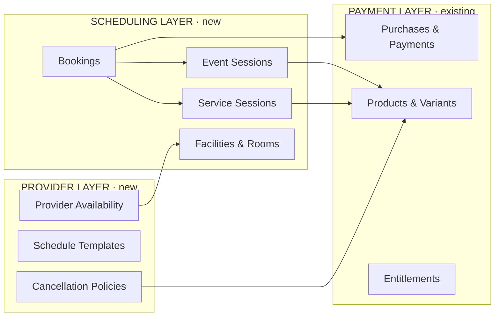

A **booking** is created alongside a **purchase**. The purchase handles money; the booking handles the session-specific details (which session, which seat, which provider). `purchase_items.product_id` links to the product (or variant); the `bookings` table links the purchase item to a specific session.

## Entity Relationship Diagrams

### Core Booking Model (Events)

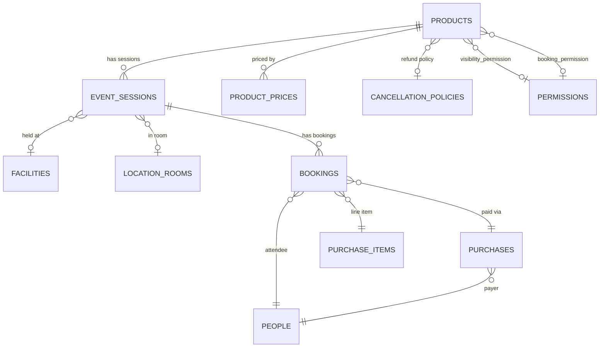

### Bookable Services Model

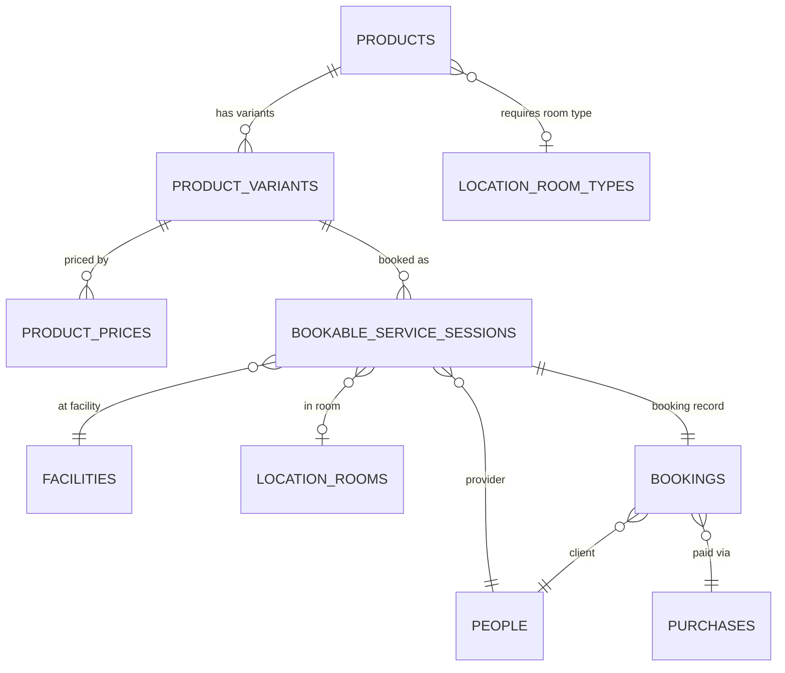

### Location Hierarchy

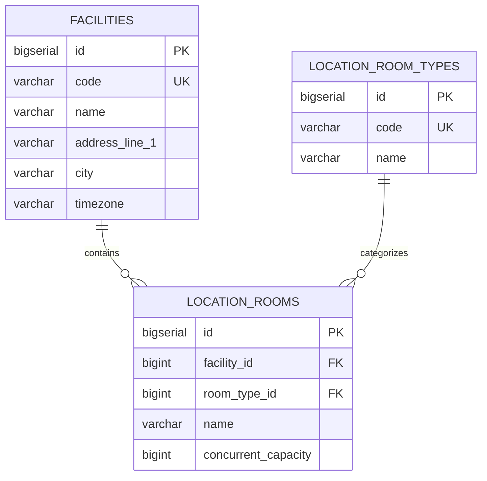

### Provider Scheduling — Types & Overrides

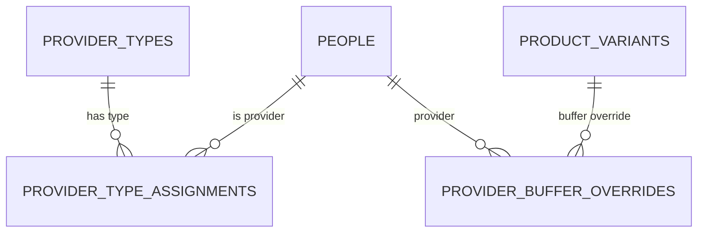

### Provider Scheduling — Availability & Schedule

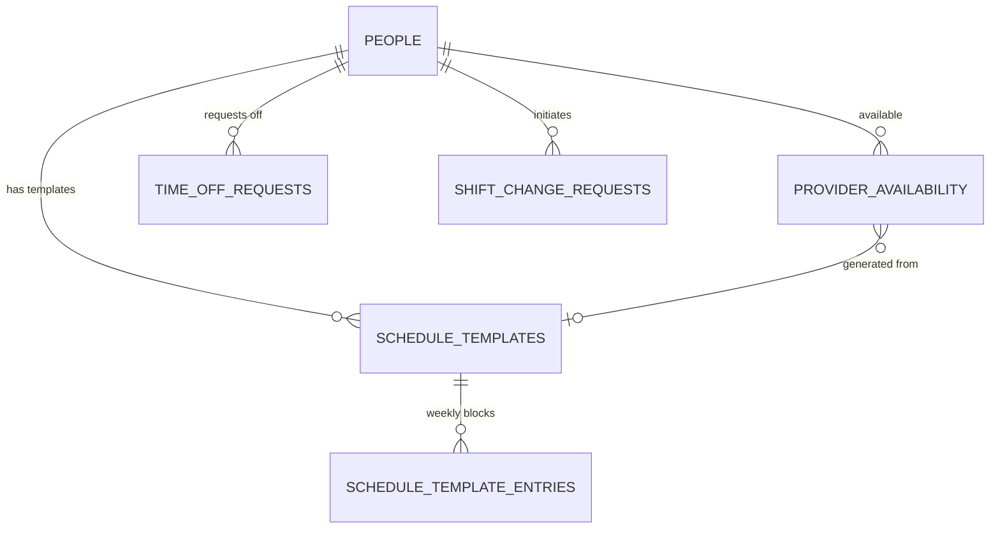

### Cancellation Policy Model

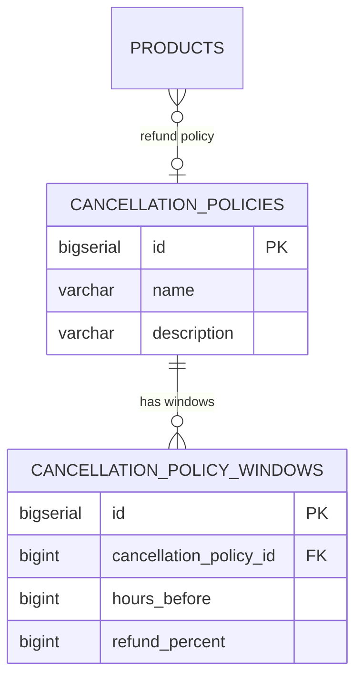

## Sequence Diagrams

### Event Booking — Browse & Select (MUST HAVE)

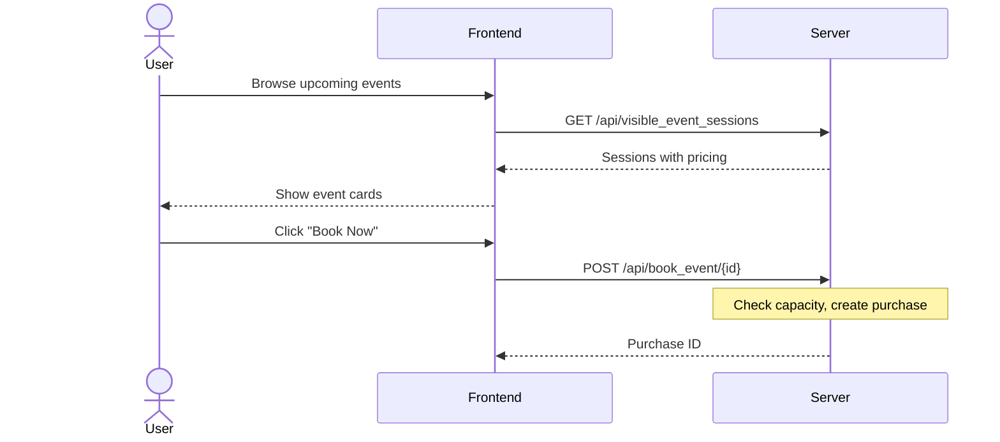

### Event Booking — Payment & Confirmation (MUST HAVE)

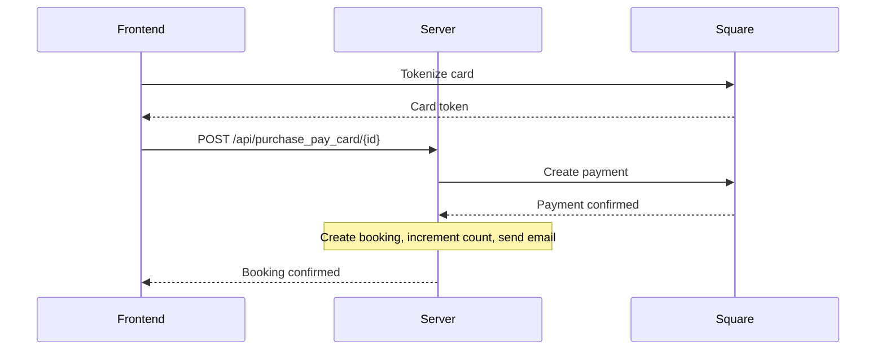

### Service Availability Computation (NICE TO HAVE)

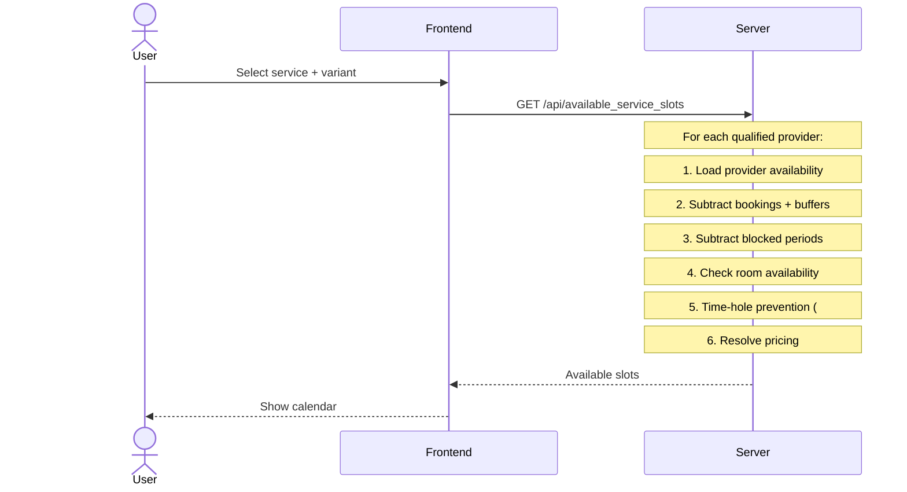

### Schedule Template — Creation & Generation (STRETCH)

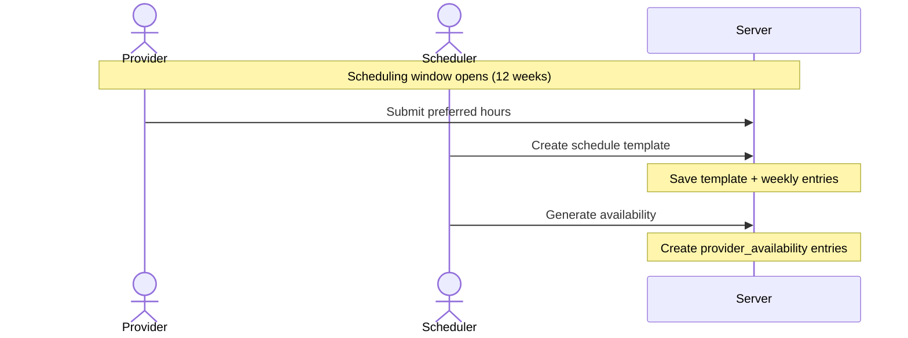

### Schedule Exceptions — Time Off & Trades (STRETCH)

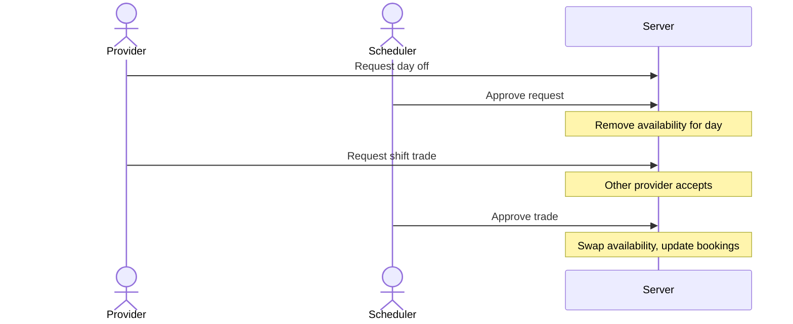

## New Tables

### facilities
Top-level physical location. Start with one; supports expansion to multiple.

| Column | Type | Notes |
|---|---|---|
| id | BIGSERIAL | PK |
| code | VARCHAR(64) | Unique. e.g., "overlake_redmond_wa" |
| name | VARCHAR(128) | Display name. e.g., "Knotty Yoga — Overlake" |
| address_line_1 | VARCHAR(256) | Street address |
| address_line_2 | VARCHAR(256) | Nullable. Suite, unit, etc. |
| city | VARCHAR(128) | |
| state | VARCHAR(64) | |
| postal_code | VARCHAR(16) | |
| country | VARCHAR(3) | ISO 3166-1 alpha-3. Default 'USA' |
| timezone | VARCHAR(64) | IANA timezone. Default 'America/Los_Angeles'. Per-facility timezone for future multi-location support. |
| is_active | BOOLEAN | Default TRUE |
| created_us | BIGINT | |
| updated_us | BIGINT | |

**Thin slice**: One row: the studio's current address with timezone 'America/Los_Angeles'.

### location_room_types
Categories of rooms/spaces. Services link to a required room type; system auto-assigns from the pool.

| Column | Type | Notes |
|---|---|---|
| id | BIGSERIAL | PK |
| code | VARCHAR(64) | Unique. e.g., "massage_room", "gym_floor", "studio_a" |
| name | VARCHAR(128) | Display name. e.g., "Massage Room" |
| description | VARCHAR(512) | Nullable |
| created_us | BIGINT | |
| updated_us | BIGINT | |

**Thin slice**: Populate with a few types (e.g., "studio", "massage_room") even if not used for resource scheduling yet.

### location_rooms
Individual rooms/spaces within a facility.

| Column | Type | Notes |
|---|---|---|
| id | BIGSERIAL | PK |
| facility_id | BIGINT | FK → facilities |
| room_type_id | BIGINT | FK → location_room_types |
| name | VARCHAR(128) | e.g., "Massage Room 1" |
| description | VARCHAR(512) | Nullable |
| concurrent_capacity | BIGINT | How many simultaneous uses. Default 1 for massage rooms, higher for gym floor slots. |
| is_active | BOOLEAN | Default TRUE |
| created_us | BIGINT | |
| updated_us | BIGINT | |

**Thin slice**: Populate with the studio's actual rooms.

### product_variants
Duration/configuration variants of a bookable service product. Events do NOT use variants.

| Column | Type | Notes |
|---|---|---|
| id | BIGSERIAL | PK |
| product_id | BIGINT | FK → products |
| code | VARCHAR(64) | Unique. e.g., "swedish_massage_60" |
| name | VARCHAR(128) | Display name. e.g., "60 Minutes" |
| duration_minutes | BIGINT | Length of this variant |
| buffer_minutes | BIGINT | Post-service buffer time. Default 0. |
| sort_order | BIGINT | Display order within the product. Default 0. |
| is_active | BOOLEAN | Default TRUE |
| created_us | BIGINT | |
| updated_us | BIGINT | |

**Pricing**: `product_prices` gains an optional `product_variant_id` column (FK → product_variants, nullable). When set, the price applies to the specific variant rather than the base product. For event products, `product_variant_id` is NULL and pricing keys on `product_id` alone.

**Thin slice**: Table exists but is empty. Event products price via `product_id` directly.

### provider_types
Tiers of service providers. Determines service capabilities and categorization.

| Column | Type | Notes |
|---|---|---|
| id | BIGSERIAL | PK |
| code | VARCHAR(64) | Unique. e.g., "junior_therapist", "senior_therapist" |
| name | VARCHAR(128) | Display name. e.g., "Senior Therapist" |
| description | VARCHAR(512) | Nullable |
| created_us | BIGINT | |
| updated_us | BIGINT | |

**Thin slice**: Populate with initial types even if not used for pricing.

### provider_type_assignments
Assigns a person to a provider type. A person can be multiple types (e.g., both a "massage therapist" and a "yoga instructor").

| Column | Type | Notes |
|---|---|---|
| id | BIGSERIAL | PK |
| person_id | BIGINT | FK → people |
| provider_type_id | BIGINT | FK → provider_types |
| is_accepting_bookings | BOOLEAN | Whether currently accepting new bookings for this type. Default TRUE. |
| created_us | BIGINT | |
| updated_us | BIGINT | |

**Unique constraint**: (person_id, provider_type_id)

**Thin slice**: Table exists but is empty.

### cancellation_policies
Defines refund rules for products. A product optionally FKs to a policy.

| Column | Type | Notes |
|---|---|---|
| id | BIGSERIAL | PK |
| name | VARCHAR(128) | e.g., "Standard 48/24 Hour Policy" |
| description | VARCHAR(512) | Nullable. Human-readable summary. |
| created_us | BIGINT | |
| updated_us | BIGINT | |

### cancellation_policy_windows
Individual time windows within a cancellation policy. Ordered by `hours_before` descending.

| Column | Type | Notes |
|---|---|---|
| id | BIGSERIAL | PK |
| cancellation_policy_id | BIGINT | FK → cancellation_policies |
| hours_before | BIGINT | Cancellation must be this many hours before start. 0 = any time. |
| refund_percent | BIGINT | 0-100. e.g., 100 = full refund, 50 = half, 0 = no refund. |
| created_us | BIGINT | |
| updated_us | BIGINT | |

**Example**: "Standard 48/24 Hour Policy" has windows: (48h → 100%), (24h → 50%), (0h → 0%).

**Resolution logic**: Find the window with the largest `hours_before` that is ≤ the hours remaining before the session. That window's `refund_percent` applies.

**Thin slice**: Table exists, possibly with a default policy, but refund flow is not wired up.

### event_sessions
Represents a specific instance of an event product occurring at a date and time.

| Column | Type | Notes |
|---|---|---|
| id | BIGSERIAL | PK |
| product_id | BIGINT | FK → products |
| facility_id | BIGINT | FK → facilities. Nullable (for virtual/off-site events). |
| location_room_id | BIGINT | FK → location_rooms. Nullable. The room where the event takes place (e.g., "Main Gym"). Informational for events, displayed as the location. |
| start_time_us | BIGINT | Event start (microseconds UTC) |
| end_time_us | BIGINT | Event end (microseconds UTC) |
| capacity | BIGINT | Max attendees (overrides product default if set) |
| booked_count | BIGINT | Current confirmed bookings (maintained by server). Default 0. |
| status | VARCHAR(32) | "scheduled", "cancelled", "completed" |
| show_on_home_page | BOOLEAN | Whether to show on home page. Default FALSE. |
| home_page_visible_from_us | BIGINT | When to start showing on home page. Nullable. |
| show_on_upcoming | BOOLEAN | Whether to show in upcoming events. Default FALSE. |
| upcoming_visible_from_us | BIGINT | When to start showing in upcoming events. Nullable. |
| cancellation_reason | VARCHAR(256) | Reason for admin cancellation. Shown in email to attendees. Nullable. |
| notes | VARCHAR(1024) | Admin notes (not public). Nullable. |
| created_us | BIGINT | |
| updated_us | BIGINT | |

**Key design decisions:**
- `booked_count` is maintained by the server (incremented on booking, decremented on cancellation) rather than computed via COUNT query. This avoids expensive queries on every availability check.
- Visibility is time-windowed: `show_on_home_page = true AND home_page_visible_from_us <= now AND start_time_us > now` determines if the event is currently visible.
- `end_time_us` is computed from `start_time_us` + product duration at creation time but stored explicitly so duration changes on the product don't retroactively change existing sessions.
- `facility_id` and `location_room_id` are informational for events (displayed to attendees as the location, e.g., "Main Gym at Knotty Yoga — Overlake") — not a resource constraint like they are for bookable services.

### bookings
Links a purchase/purchase_item to a specific session. Used for both events and bookable services.

| Column | Type | Notes |
|---|---|---|
| id | BIGSERIAL | PK |
| event_session_id | BIGINT | FK → event_sessions. Nullable (NULL for bookable service bookings). |
| service_session_id | BIGINT | FK → bookable_service_sessions. Nullable (NULL for event bookings). |
| purchase_id | BIGINT | FK → purchases |
| purchase_item_id | BIGINT | FK → purchase_items |
| person_id | BIGINT | FK → people (the attendee / client) |
| provider_person_id | BIGINT | FK → people. Nullable. The provider for service bookings. NULL for events. |
| status | VARCHAR(32) | "confirmed", "waitlisted", "cancelled", "attended", "no_show" |
| waitlist_position | BIGINT | Nullable. Position in waitlist queue (1-based). NULL if not waitlisted. |
| cancelled_us | BIGINT | Nullable |
| checked_in_us | BIGINT | Nullable |
| notes | VARCHAR(1024) | Client notes. Nullable. |
| created_us | BIGINT | |
| updated_us | BIGINT | |

**Constraints**:
- CHECK: exactly one of `event_session_id` or `service_session_id` must be non-NULL.
- Unique: (event_session_id, person_id) where status = "confirmed" — prevents double-booking same event.
- Unique: (service_session_id) where status = "confirmed" — a service session is 1:1 with a confirmed booking.

### bookable_service_sessions
A specific booked (or bookable) time slot for a service appointment. Created when a service is booked.

| Column | Type | Notes |
|---|---|---|
| id | BIGSERIAL | PK |
| product_id | BIGINT | FK → products |
| product_variant_id | BIGINT | FK → product_variants |
| provider_person_id | BIGINT | FK → people (the provider) |
| facility_id | BIGINT | FK → facilities |
| location_room_id | BIGINT | FK → location_rooms. Nullable (auto-assigned or manual). |
| start_time_us | BIGINT | Service start (microseconds UTC) |
| end_time_us | BIGINT | Service end (microseconds UTC) |
| buffer_end_us | BIGINT | End of post-service buffer (microseconds UTC) |
| status | VARCHAR(32) | "scheduled", "cancelled", "completed" |
| cancellation_reason | VARCHAR(256) | Nullable |
| notes | VARCHAR(1024) | Admin/provider notes. Nullable. |
| created_us | BIGINT | |
| updated_us | BIGINT | |

**Thin slice**: Table exists but is empty. Used starting with NICE TO HAVE tier.

### schedule_templates
Recurring weekly availability pattern for a provider. Managed by users with `manage_schedules` permission.

| Column | Type | Notes |
|---|---|---|
| id | BIGSERIAL | PK |
| provider_person_id | BIGINT | FK → people |
| name | VARCHAR(128) | e.g., "Jane Doe — Spring 2026" |
| effective_from_us | BIGINT | When this template takes effect |
| effective_to_us | BIGINT | When this template expires. Nullable (open-ended). |
| is_active | BOOLEAN | Default TRUE |
| created_us | BIGINT | |
| updated_us | BIGINT | |

### schedule_template_entries
Individual time blocks within a weekly template. Day-of-week + start/end times.

| Column | Type | Notes |
|---|---|---|
| id | BIGSERIAL | PK |
| schedule_template_id | BIGINT | FK → schedule_templates |
| day_of_week | BIGINT | 0=Sunday, 1=Monday, ..., 6=Saturday |
| start_time_minutes | BIGINT | Minutes from midnight. e.g., 480 = 8:00 AM |
| end_time_minutes | BIGINT | Minutes from midnight. e.g., 1020 = 5:00 PM |
| created_us | BIGINT | |

**Thin slice**: Table exists but is empty.

### provider_availability
Concrete availability windows for a provider on specific dates. Generated from templates or entered manually. This is what the booking system queries.

| Column | Type | Notes |
|---|---|---|
| id | BIGSERIAL | PK |
| provider_person_id | BIGINT | FK → people |
| facility_id | BIGINT | FK → facilities |
| date_us | BIGINT | The date (midnight UTC of the day) |
| start_time_us | BIGINT | Available from (microseconds UTC) |
| end_time_us | BIGINT | Available until (microseconds UTC) |
| source | VARCHAR(32) | "template", "manual", "override" — how this entry was created |
| schedule_template_id | BIGINT | FK → schedule_templates. Nullable. Set if generated from template. |
| is_blocked | BOOLEAN | TRUE for unavailable blocks (lunch, personal time). Default FALSE. |
| created_us | BIGINT | |
| updated_us | BIGINT | |

**Thin slice**: Table exists but is empty.

### time_off_requests
Provider requests for days off. Requires `manage_schedules` approval.

| Column | Type | Notes |
|---|---|---|
| id | BIGSERIAL | PK |
| provider_person_id | BIGINT | FK → people |
| requested_date_us | BIGINT | The date requested off |
| reason | VARCHAR(256) | e.g., "vacation", "appointment". Nullable. |
| status | VARCHAR(32) | "pending", "approved", "denied" |
| reviewed_by_person_id | BIGINT | FK → people. The scheduler who reviewed. Nullable. |
| reviewed_us | BIGINT | Nullable |
| review_notes | VARCHAR(512) | Nullable |
| created_us | BIGINT | |
| updated_us | BIGINT | |

**Thin slice**: Table exists but is empty.

### shift_change_requests
Covers both shift transfers (give shift to another provider) and shift trades (swap shifts). Multi-party approval.

| Column | Type | Notes |
|---|---|---|
| id | BIGSERIAL | PK |
| request_type | VARCHAR(32) | "transfer" or "trade" |
| requesting_person_id | BIGINT | FK → people. The provider initiating. |
| target_person_id | BIGINT | FK → people. The other provider. |
| requesting_availability_id | BIGINT | FK → provider_availability. The shift being given/traded. |
| target_availability_id | BIGINT | FK → provider_availability. Nullable. For trades: the shift being received. NULL for transfers. |
| status | VARCHAR(32) | "pending_target", "pending_scheduler", "approved", "denied", "cancelled" |
| target_response_us | BIGINT | When target provider responded. Nullable. |
| target_accepted | BOOLEAN | Nullable. |
| reviewed_by_person_id | BIGINT | FK → people. Scheduler who approved/denied. Nullable. |
| reviewed_us | BIGINT | Nullable |
| notes | VARCHAR(512) | Nullable |
| created_us | BIGINT | |
| updated_us | BIGINT | |

**Status flow**: pending_target → (target accepts) → pending_scheduler → (scheduler approves) → approved.

**Thin slice**: Table exists but is empty.

### provider_buffer_overrides
Per-provider buffer time preferences that override the variant's default.

| Column | Type | Notes |
|---|---|---|
| id | BIGSERIAL | PK |
| provider_person_id | BIGINT | FK → people |
| product_variant_id | BIGINT | FK → product_variants |
| buffer_minutes | BIGINT | Override buffer. System uses MAX(variant default, provider override). |
| created_us | BIGINT | |
| updated_us | BIGINT | |

**Unique constraint**: (provider_person_id, product_variant_id)

**Thin slice**: Table exists but is empty.

## Modifications to Existing Tables

### products — new columns

| Column | Type | Notes |
|---|---|---|
| default_capacity | BIGINT | Nullable. Default max attendees for event products. |
| duration_minutes | BIGINT | Nullable. Default duration for event products. Bookable service durations live on `product_variants` instead. |
| visibility_permission_id | BIGINT | FK → permissions. Nullable. NULL = visible to everyone. |
| booking_permission_id | BIGINT | FK → permissions. Nullable. NULL = anyone can book. |
| cancellation_policy_id | BIGINT | FK → cancellation_policies. Nullable. NULL = no refund policy configured. |
| required_room_type_id | BIGINT | FK → location_room_types. Nullable. For bookable services: what type of room is needed. NULL for events. |
| advance_booking_days | BIGINT | Nullable. How far in advance users can book (days). NULL = no limit. |
| booking_cutoff_hours | BIGINT | Nullable. Can't book within this many hours of the service. NULL = no cutoff. |
| reminder_hours | BIGINT | Nullable. Hours before session to send reminder email. NULL = use server default. |
| max_time_hole_minutes | BIGINT | Nullable. Provider time-hole tolerance (scenario 28). NULL = no constraint. |

New `kind` values: `"event"`, `"bookable_service"`.

### product_prices — new column

| Column | Type | Notes |
|---|---|---|
| product_variant_id | BIGINT | FK → product_variants. Nullable. If set, this price is for the variant; if NULL, for the base product. |

Update unique constraint: `(product_id, price_schedule_id, permission_id, product_variant_id)`.

### purchase_items — new column

| Column | Type | Notes |
|---|---|---|
| product_variant_id | BIGINT | FK → product_variants. Nullable. NULL for events and non-variant products. Records which variant was purchased so the line item has a complete pricing audit trail. |

## Server Configuration (config_secrets table)

| Key | Example Value | Purpose |
|---|---|---|
| `default_studio_timezone` | `"America/Los_Angeles"` | Fallback timezone (used if facility lacks one). Defaults to Pacific. |
| `event_reminder_hours` | `"24"` | Default hours before event to send reminder. Overridden by product-level `reminder_hours`. |
| `waitlist_cancel_window_hours` | `"2"` | Hours within which a waitlisted user can cancel for full refund. |
| `time_off_min_advance_days` | `"14"` | Minimum days in advance for time-off requests. |
| `time_off_max_advance_days` | `"84"` | Maximum days in advance for time-off requests (84 = 12 weeks). |
| `schedule_window_weeks` | `"12"` | How many weeks out to generate availability from templates. |

---

# Implementation Plans

## MUST HAVE — Intro Workshop End-to-End
Implementation document: [[Scheduling thin slice]]

*Scenarios: 1-4, 7, 9-11, 14, 40, 57-58, 65*

### What It Delivers
1. Admin creates an "Intro Workshop" event product with duration, capacity, and pricing
2. Admin creates session instances (e.g., "March 15 at 2pm") with a facility reference
3. Admin configures when sessions appear in the "Upcoming Events" section
4. Sessions appear on the upcoming events page for visitors and users
5. Users book via existing purchase + payment flow
6. Booking creates a reservation record; capacity is tracked
7. User receives booking confirmation email (extends existing payment confirmation)
8. User sees upcoming and past booked events in their portal
9. Admin views the attendee list for a session
10. Sessions auto-close when at capacity ("Sold Out")
11. All times display in studio timezone

### Phase 1: Full Schema + Seed Data
- Create ALL scheduling tables listed in the data model above (including tables not used until later tiers)
- Add new columns to `products` and `product_prices`
- Add config_secrets entries
- Seed default facility, a couple of location_room_types, and location_rooms
- Admin can create event products and session instances via the admin table UI

### Phase 2: Public Event Listing
- Implement `GET /api/visible_event_sessions?placement=upcoming` (and `?placement=home_page`)
- Flexible endpoint with placement filter (per resolved decision Q3)
- Create upcoming events frontend page
- Events display with date, time (in facility timezone), capacity, pricing
- Timezone formatting using facility's timezone

### Phase 3: Booking Flow
- Implement booking endpoint (wraps existing purchase flow — two-step: create purchase, then pay)
- Frontend event booking page with "Book and Pay" flow
- Capacity tracking (increment `booked_count`, reject when full → "Sold Out")
- Booking confirmation email (extend existing `PaymentConfirmationMail` with event details)

### Phase 4: User Portal + Admin Views
- `GET /api/my_bookings` — user's upcoming and past bookings
- "My Events" section in user portal (`/my/events`)
- `GET /api/admin/event_session/{id}/attendees` — attendee list for a session
- Admin attendee list view

### Phase 5: Polish
- "Sold Out" state display
- Auto-hide events after they occur
- Non-logged-in flow: show events publicly, prompt login/register on "Book" click

## SHOULD HAVE — Event Polish

*Scenarios: 5-6, 8, 12-13, 15-16, 42, 59-60, 64*

### What It Delivers
- Visibility permissions (member-only vs public events)
- Booking permissions (restrict who can book vs who can see)
- Home page event visibility with time windows
- Account-creation-on-booking flow for non-logged-in visitors
- Reminder emails (server-side scheduled job)
- Cancellation policy configuration and refund flow
- User views booking details with cancel button and refund info
- Admin overrides session capacity
- Admin cancels entire session (with reason, email notification, bulk refund)
- Booking conflict prevention (user can't double-book overlapping events)

### Phase 6: Visibility & Booking Permissions
- Implement `visibility_permission_id` and `booking_permission_id` filtering in event listing endpoints
- Non-logged-in users see public events; "Book" button → register/login flow
- Member-only events filtered from public views; shown to users with matching permission

### Phase 7: Cancellation & Refunds
- Wire cancellation_policies and cancellation_policy_windows into the booking flow
- Admin creates cancellation policies via admin table UI
- User cancellation flow: display refund percentage based on time remaining
- Process refund via existing payment refund infrastructure
- Release seat on cancellation (decrement `booked_count`)

### Phase 8: Reminders & Home Page
- Server-side reminder job (poll for bookings where event is within `reminder_hours`)
- Home page visibility window integration
- Admin session management: override capacity, cancel entire session with reason

### Phase 9: Conflict Prevention
- Before booking, check if user has any overlapping confirmed bookings
- Return clear error message if conflict detected

## NICE TO HAVE — Bookable Services Foundation

*Scenarios: 19-21, 24-25, 29-30, 32-34, 66*

### What It Delivers
- Bookable service products (kind="bookable_service") with duration variants
- Location resource management (rooms auto-assigned by type)
- Provider availability entry (manual blocks)
- User-facing availability calendar showing bookable slots
- Service booking flow (select provider + time → purchase + booking)
- Service confirmation email
- Basic service cancellation with full refund

### Phase 10: Service Products & Variants
- Admin creates bookable_service products
- Admin creates product_variants with duration, buffer, and pricing
- `product_prices` with `product_variant_id` for variant-specific pricing
- Location room management via admin UI (rooms are already in schema from Phase 1)

### Phase 11: Provider Availability
- Admin/scheduler enters availability blocks for providers
- Provider unavailable blocks (lunch, etc.) within availability
- `provider_availability` table populated manually (template-based generation deferred to STRETCH)
- `provider_type_assignments` wired up so providers are linked to service capabilities

### Phase 12: Availability Computation & Booking
- Compute available time slots by intersecting: provider availability, existing bookings + buffers, location room availability
- Sequential slot computation (scenario 66): next slot = previous booking end + MAX(variant buffer, provider buffer override). Prevent orphaned gaps that are too small for any service.
- Calendar/list view in frontend showing available slots
- User selects provider, variant (duration), and time slot
- Booking creates: purchase + purchase_item + payment + booking + bookable_service_session
- Room auto-assignment from pool of available rooms of required type

### Phase 13: Service Confirmation & Cancellation
- Service booking confirmation email (provider name, location, duration, cancellation policy)
- Full-refund cancellation within window
- Release provider time slot and room on cancellation

## COULD HAVE — Rough Scope

*Scenarios: 17-18, 22-23, 27-28, 31, 35-39, 41*

Not fully planned but the data model supports these without schema changes:
- **Rescheduling** (17): Cancel + rebook. Frontend "Reschedule" button finds other available sessions of same product.
- **Waitlist** (18): `bookings.status = "waitlisted"` + `waitlist_position`. Auto-promote on cancellation.
- **Booking windows per permission** (22): Add `booking_window_overrides` table if needed, or extend `product_prices` with booking window columns.
- **Service reminders** (23): Same mechanism as event reminders (Phase 8).
- **Provider buffer overrides** (27): `provider_buffer_overrides` table already in schema.
- **Time-hole tolerance** (28): `products.max_time_hole_minutes` already in schema. Availability computation filters slots that create gaps exceeding tolerance.
- **Slot filtering** (31): Frontend filter UI on availability calendar.
- **Tiered cancellation** (35-36): `cancellation_policy_windows` already supports multiple tiers.
- **Check-in and attendance** (37-38): `bookings.checked_in_us` and `bookings.status = "attended"` already in schema. Staff UI marks attendance.
- **Book for someone else** (39): Existing payer/beneficiary model. `bookings.person_id` = friend.
- **Calendar view** (41): Frontend calendar component consuming `GET /api/my_bookings`.

## STRETCH — Rough Scope

*Scenarios: 43-56, 61-63*

Not fully planned but the data model supports these without schema changes:
- **Admin booking management** (43-44): Admin endpoints for cancel/reassign with override capabilities.
- **Provider portal** (45-48): New frontend section gated by `provider` permission. Queries bookings and availability filtered to current user.
- **Schedule templates** (49-50): `schedule_templates` and `schedule_template_entries` tables already in schema. Batch generation populates `provider_availability`.
- **Time-off requests** (51): `time_off_requests` table already in schema. Approval flow.
- **Shift changes** (52-53): `shift_change_requests` table already in schema. Multi-party approval flow.
- **Provider schedule/booking views** (54-56): Provider-filtered queries on existing availability and booking tables.
- **No-show tracking** (61): `bookings.status = "no_show"`. Batch job marks un-checked-in bookings after event passes.
- **Admin comp re-slot** (62): Create booking with $0 comp purchase (existing payment system supports $0 purchases).
- **Analytics** (63): Reporting queries over bookings, event_sessions, payments. Dashboard frontend.

---

# API Endpoints

## Public / Customer

| Method | Endpoint | Description | Tier |
|---|---|---|---|
| GET | `/api/visible_event_sessions?placement={type}` | List visible event sessions filtered by placement (home_page, upcoming). Respects visibility permissions and time windows. Includes resolved pricing for current user. | MUST |
| GET | `/api/event_session/{session_id}` | Session details: capacity, remaining spots, resolved price, facility | MUST |
| POST | `/api/book_event/{session_id}` | Create purchase + booking for event. Two-step: creates purchase, frontend handles payment via existing flow. | MUST |
| GET | `/api/my_bookings?type={event\|service}&status={upcoming\|past}` | User's bookings with optional filters | MUST |
| GET | `/api/available_service_slots?product_id=X&variant_id=Y&date_from=Z&date_to=W&provider_id=P` | Compute and return available time slots for a bookable service | NICE |
| POST | `/api/book_service` | Create purchase + booking + service session for a service appointment | NICE |
| POST | `/api/cancel_booking/{booking_id}` | Cancel a booking. Returns refund info based on cancellation policy. | SHOULD |

## Admin

| Method | Endpoint | Description | Tier |
|---|---|---|---|
| POST | `/api/admin/event_session` | Create a new event session for a product | MUST |
| PUT | `/api/admin/event_session/{session_id}` | Update session details (capacity, visibility, times) | MUST |
| DELETE | `/api/admin/event_session/{session_id}` | Cancel a session (with reason) | SHOULD |
| GET | `/api/admin/event_session/{session_id}/attendees` | List all bookings for a session | MUST |
| POST | `/api/admin/provider_availability` | Create availability block for a provider | NICE |
| POST | `/api/admin/cancel_booking/{booking_id}` | Admin cancels any booking (full refund regardless of policy) | STRETCH |

**Note on booking flow**: The `POST /api/book_event/{session_id}` endpoint keeps the existing two-step purchase flow for consistency. Internally it creates a purchase + purchase_item with server-resolved pricing. The frontend auto-advances to the payment step (Square card form). This reuses all existing payment infrastructure.

---

# Frontend Changes

## MUST HAVE Components

1. **Upcoming Events Page** (`/events` or section on home page)
   - Fetches `GET /api/visible_event_sessions?placement=upcoming`
   - Event cards: name, date/time (in facility timezone), remaining spots, price
   - "Book Now" button → event booking page

2. **Home Page Integration**
   - Replace mock calendar data with `GET /api/visible_event_sessions?placement=home_page`
   - Upcoming events section with real data

3. **Event Booking Page** (`/events/{session_id}/book`)
   - Event details, price, remaining capacity, facility info
   - "Book and Pay" → creates purchase, auto-advances to existing payment/checkout flow

4. **My Events Section** (user portal at `/my/events`)
   - Upcoming and past events with status (confirmed, attended, cancelled)

5. **Admin: Session Management** (admin portal)
   - CRUD for event sessions via admin table UI
   - Attendee list view per session

## SHOULD HAVE Components

6. **Login/Register Prompt** — non-logged-in user sees event, clicks "Book", gets registration prompt
7. **Booking Detail View** — full details with cancel button showing refund tier
8. **Admin: Cancellation Policy Editor** — manage cancellation policies and windows

## NICE TO HAVE Components

9. **Service Availability Calendar** — browse available slots filtered by service, provider, date range
10. **Service Booking Flow** — select variant (duration), provider, time slot, book and pay
11. **Admin: Provider Availability Editor** — enter/modify availability blocks for providers

## Existing Components Reused
- Payment/checkout flow (Square Web Payments SDK)
- Purchase history (bookings appear as purchases with event/service products)
- Email confirmation (extend `PaymentConfirmationMail` with session-specific details)
- Admin table UI (new tables appear automatically via the schema system)

---

# Required Changes to Payment Design Document

The payment system tables are already implemented in code. This section tracks every change needed to both the Payment Design Document and the existing codebase to support scheduling. **Work item: update the Payment Design Document once these changes are finalized.**

## Schema Changes to Existing Implemented Tables

These are changes to tables that already exist in the codebase (`db_schema/`). Each requires both a document update and a code migration.

### products — add 10 columns, 2 new kind values

The `products` table currently has: `id`, `code`, `name`, `description`, `kind` ("one_time" | "subscription"), `is_active`, `created_us`, `updated_us`.

**New columns to add:**

| Column | Type | Notes |
|---|---|---|
| default_capacity | BIGINT | Nullable. Max attendees for event products. |
| duration_minutes | BIGINT | Nullable. Default duration for events. Services use `product_variants.duration_minutes`. |
| visibility_permission_id | BIGINT | FK → permissions. Nullable. NULL = visible to everyone including anonymous visitors. |
| booking_permission_id | BIGINT | FK → permissions. Nullable. NULL = anyone can book. |
| cancellation_policy_id | BIGINT | FK → cancellation_policies. Nullable. |
| required_room_type_id | BIGINT | FK → location_room_types. Nullable. For bookable services only. |
| advance_booking_days | BIGINT | Nullable. How far in advance users can book. |
| booking_cutoff_hours | BIGINT | Nullable. Minimum hours before session to allow booking. |
| reminder_hours | BIGINT | Nullable. Hours before session to send reminder. NULL = server default. |
| max_time_hole_minutes | BIGINT | Nullable. Provider time-hole tolerance for services. |

**New `kind` values:** `"event"`, `"bookable_service"` (alongside existing `"one_time"`, `"subscription"`).

**Code impact:** Update `db_schema/products.cpp`, table helper, any admin display templates, and catalog product endpoint response serialization.

### product_prices — add column, change unique constraint

The `product_prices` table currently has a unique constraint on `(product_id, price_schedule_id, permission_id)`.

**New column:**

| Column | Type | Notes |
|---|---|---|
| product_variant_id | BIGINT | FK → product_variants. Nullable. NULL = price is for the base product; non-NULL = price is for a specific variant. |

**Constraint change:** Unique constraint becomes `(product_id, price_schedule_id, permission_id, product_variant_id)`.

**Code impact:** Update `db_schema/product_prices.cpp`, pricing resolution logic in purchase creation, catalog quote endpoint.

### purchase_items — add product_variant_id (GAP)

**This is a gap in both documents.** The scheduling doc does not add `product_variant_id` to `purchase_items`, but it is needed so that a purchase line item records which variant was purchased for services.

Currently `purchase_items` records `product_id` and pricing snapshots (`unit_price_cents`, `price_schedule_id`, `pricing_permission_id`). For service bookings, the variant determines the duration and price, so the line item should also record which variant was selected.

| Column | Type | Notes |
|---|---|---|
| product_variant_id | BIGINT | FK → product_variants. Nullable. NULL for events and non-variant products. |

**Code impact:** Update `db_schema/purchase_items.cpp`, purchase creation logic, purchase detail responses.

## Pricing Resolution Changes

The Payment Design Document describes a 3-step pricing resolution:
1. Find the active `price_schedule` for the current date
2. Match the best `product_prices` row for the user's permissions (specific permission wins over NULL fallback)
3. Resolve `amount_cents`

Scheduling extends this to a 4-step process for bookable services:
1. Find the active `price_schedule`
2. Look up `product_prices` rows matching `product_variant_id` (new filter dimension)
3. Match the best row for the user's permissions (same logic as today, just with the additional variant filter)
4. Record resolved price on `purchase_items` with `product_variant_id`

The key change is step 2 — the existing pricing resolution gains `product_variant_id` as an additional filter dimension. Permission-based pricing works exactly as it does today, just scoped to the variant. No provider-based pricing overrides (see Alternatives Considered).

**Code impact:** The pricing resolution code in `PaymentHelper` (or wherever `purchase_create` resolves prices) needs to accept an optional `product_variant_id` parameter and filter `product_prices` rows accordingly.

## Post-Payment Fulfillment Changes

The current payment flow after a purchase becomes fully funded:
1. Create `entitlements` based on `product_entitlement_rules`
2. Create `entitlement_assignments`

Scheduling extends this with an additional branch:
- **If the product has a `product_entitlement_rules` row** → create entitlements (existing behavior)
- **If the product is `kind = "event"` or `"bookable_service"`** → create `bookings` row, increment `event_sessions.booked_count`, send booking confirmation email

**Key decision needed:** Do event/service products have `product_entitlement_rules` rows?
- Most likely **no** — the booking IS the access grant, not an ongoing permission
- The fulfillment code must gracefully handle products with no entitlement rules (currently every product is assumed to have one)
- The Payment Design Document's `product_entitlement_rules` has a unique constraint on `product_id`, implying one rule per product but not requiring one

**Code impact:** Extend `PaymentHelper::PayWithCard` (or equivalent) to check product kind after payment confirmation and branch to booking creation. This is the most architecturally significant change — it introduces scheduling awareness into the payment layer.

## Cancellation / Refund Dependency

The scheduling system's SHOULD HAVE tier depends on refund infrastructure:
- Cancellation policies compute a `refund_percent` based on time windows
- User cancellation triggers a partial or full refund via the existing payment refund model
- Admin cancellation always triggers a full refund

**Current state:** The Payment Design Document defers refunds to Phase 6 ("Handle in Future"). The `payments` table already has `refund_for_payment_id` and `refund_reason` columns, but the refund flow may not be implemented yet.

**Dependency:** Scheduling's SHOULD HAVE cannot ship without at least basic refund support (create a refund payment record, update purchase status). The Payment Design Document should move refunds to an earlier phase or note the scheduling dependency.

## $0 Comp Purchases

The scheduling doc assumes $0 purchases work for:
- Admin comps a re-slot into another session (scenario 62)
- Potentially other admin-granted bookings

The Payment Design Document mentions comps in "Handle in Future" scenarios (28-29) with partial support via `provider="comp"`, `amount_cents=0`, `total_cents=0`, `status="funded"`.

**Decision needed:** Confirm that the purchase creation flow supports `total_cents = 0` and auto-transitions to `status = "funded"` without requiring a payment. If not, this needs to be added before scheduling's SHOULD HAVE tier.

## Idempotency for Booking Endpoints

The Payment Design Document emphasizes idempotency for all mutating operations (via `idempotency_keys` table and `Idempotency-Key` header). The scheduling booking endpoints also need idempotency:

- `POST /api/book_event/{session_id}` — prevents double-booking the same event
- `POST /api/book_service` — prevents double-booking the same time slot
- `POST /api/cancel_booking/{booking_id}` — prevents double-refund

These should use the same `idempotency_keys` infrastructure.

## Documentation-Only Updates

These are changes to the Payment Design Document text that don't require code changes:

1. **Out of Scope section** — currently lists "Integration with existing classes table / scheduling system" as deferred. Update to reference this document as the design for that integration.

2. **Product model section** — note that `kind` has been extended with "event" and "bookable_service" values, and cross-reference this document for the scheduling-specific columns.

3. **API endpoints table** — add the booking-related endpoints that wrap the purchase flow (`book_event`, `book_service`, `cancel_booking`).

4. **Purchase flow section** — note that `book_event` and `book_service` are additional entry points that wrap `purchase_create` with booking-specific logic.

5. **Entitlements section** — note that event/service products may not have `product_entitlement_rules` rows, and the fulfillment code handles this gracefully.

## Summary: Work Items

| #   | Change                                                                  | Scope          | Prerequisite For      |
| --- | ----------------------------------------------------------------------- | -------------- | --------------------- |
| 1   | Add 10 columns to `products` table + 2 new kind values                  | Schema + code  | MUST HAVE Phase 1     |
| 2   | Add `product_variant_id` to `product_prices` + update unique constraint | Schema + code  | NICE TO HAVE Phase 10 |
| 3   | Add `product_variant_id` to `purchase_items`                            | Schema + code  | NICE TO HAVE Phase 10 |
| 4   | Extend pricing resolution for variant filtering                         | Business logic | NICE TO HAVE Phase 12 |
| 5   | Handle products without `product_entitlement_rules` in fulfillment      | Business logic | MUST HAVE Phase 3     |
| 6   | Add booking creation to post-payment fulfillment                        | Business logic | MUST HAVE Phase 3     |
| 7   | Implement basic refund flow (or move up from Phase 6)                   | Business logic | SHOULD HAVE Phase 7   |
| 8   | Support $0 comp purchases                                               | Business logic | SHOULD HAVE           |
| 9   | Add idempotency to booking endpoints                                    | Infrastructure | MUST HAVE Phase 3     |
| 10  | Update Payment Design Document text                                     | Documentation  | After all above       |